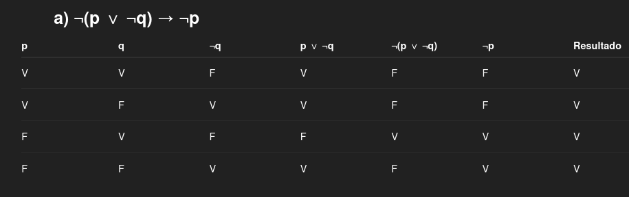
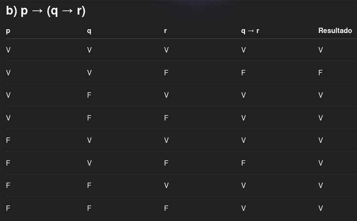
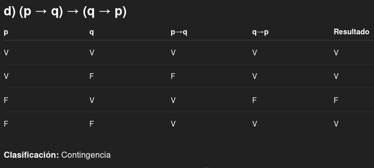
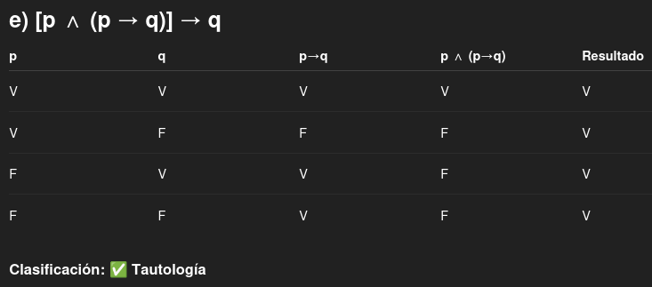
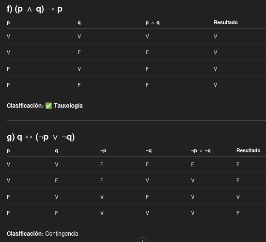
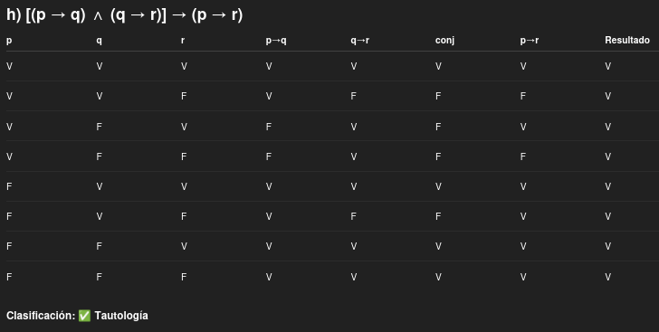
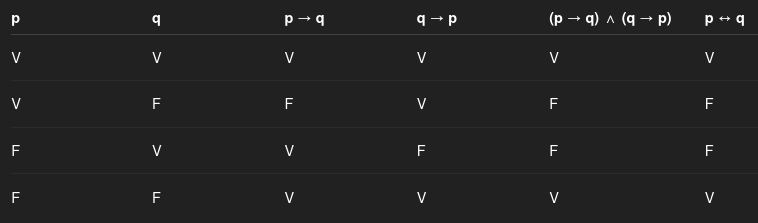
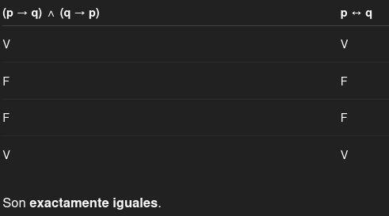
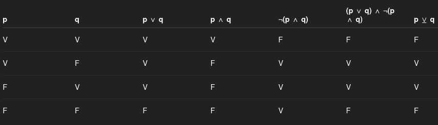
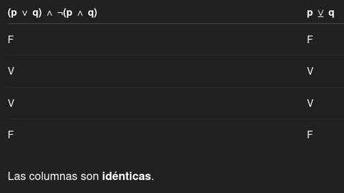

## Proposición
Una oración que **afirma algo** pero puede ser **verdadero o falso**.
Es decir, puede tener un **valor de verdad**. Verdadero o falso.

Que __NO__ es una proposición:
- Preguntas
- Exclamaciones
- Oraciones con variables sin especificar (oraciones abiertas)

## Proposición primitiva
Proposiciones que **no se pueden dividir** en otras proposiciones más pequeñas **usando conectores lógicos**
 - y
 - o
 - Si.. entonces.
 - Sí y sólo sí.
 - No

--------------------------------------------

## Ejercicios

### 1. Determine cuál de las siguientes oraciones son proposiciones
_a) Este año Juan va a cursar Matemática Discreta._
Esta oración **afirma un hecho** y **primitiva**

_b) x + 3 es un entero positivo._
Si bien puede ser verdadero o falso, **X** es una variable. Es decir que **el valor de la verdad** depende de X.
No es proposición. Es una oración abierta o funcion proposicional.

c) ¡Si todas las mañanas fueran tan soleadas y despejadas como esta!
NO es una proposición. **Es una exclamación o deseo**

d) Quince es un número par.
Está afirmando algo y ese algo no depende de nadie. Por lo tanto, es una **proposición primitiva**

e) Si Josefina llegara tarde a la fiesta, su primo Juan se va a enojar.
**Proposición**. Puede ser verdadera o falso. Es una oración condicional.
p → q

f) ¿Qué hora es?
Es una **pregunta**. No puede ser veradadera ni falsa. 

### 2. Construya una tabla de verdad para cada una de las siguientes proposiciones compuestas

**Reglas principales**
- ¬p → niega el valor
- p ∧ q → verdadera solo si ambas son V
- p ∨ q → verdadera si al menos una es V
- p → q → solo es F cuando p = V y q = F
- p ↔ q → verdadera cuando ambas **tienen el mismo valor**

**Clasificación**
- Tautología → siempre V
- Contradicción → siempre F
- Contingencia → mezcla de V y F

**Tautología**

**Contingencia**

**Contingencia**

### 3. Demostrar que s1 ⇔ s2 usando las tablas de verdad
- a) s1 : (p → q) ∧ (q → p) , s2 : p ↔ q

- b) s1 : p ⊻ q, s2 : (p ∨ q) ∧ ¬(p ∧ q)

