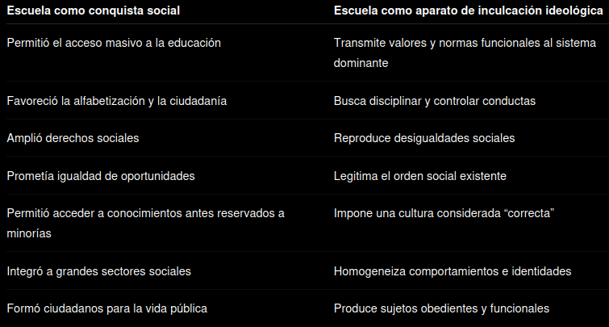
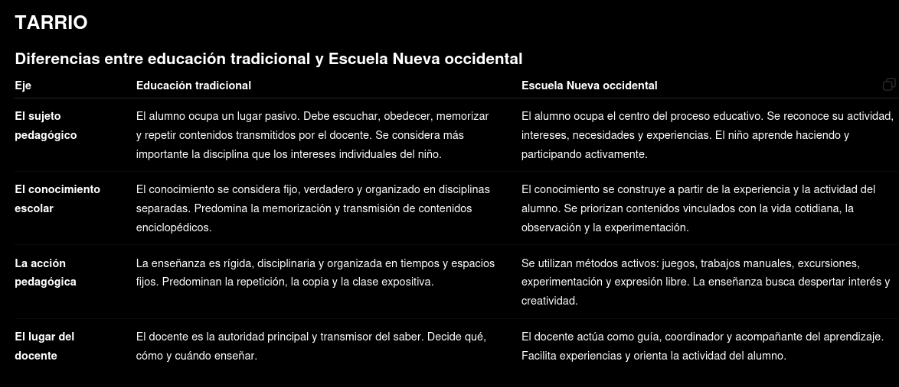

# Clase 1

## La educación como objeto y la pedagogía como campo disciplinar

### La importancia de estudiar pedagogía

La formación docente no consiste únicamente en aprender técnicas de enseñanza o estrategias para transmitir contenidos. Formarse como educador implica también construir un posicionamiento ético, político y social frente a la educación, la escuela y la sociedad.

La pedagogía permite comprender que la educación no es un hecho neutral ni natural, sino una práctica atravesada por intereses sociales, políticos, culturales e históricos. Por esta razón, estudiar pedagogía implica desarrollar una mirada crítica sobre las instituciones educativas, las prácticas escolares y las formas en que se organiza la enseñanza.

A diferencia de la didáctica, que se centra principalmente en los métodos y estrategias de enseñanza, la pedagogía busca reflexionar sobre problemas más amplios y profundos relacionados con la educación. La didáctica se pregunta cómo enseñar; la pedagogía se pregunta qué significa educar, para qué se educa, qué tipo de sujeto se busca formar y qué relación existe entre educación y sociedad.

La pedagogía permite otorgar sentido a las prácticas educativas cotidianas. Ayuda a comprender por qué la escuela funciona de determinada manera, cuáles son los fundamentos de las prácticas escolares y qué consecuencias tienen las decisiones educativas.

### Las preguntas fundamentales de la pedagogía

La pedagogía se constituye como un campo de conocimiento que intenta responder preguntas fundamentales acerca de la educación y la escuela.

#### ¿Qué es la escuela y por qué existe?

La pedagogía analiza qué es la escuela, cómo surgió históricamente y cuáles son las funciones que cumple dentro de la sociedad. También estudia por qué la escuela moderna adoptó determinadas formas de organización y no otras.

#### ¿Por qué la escuela es como es?

La organización del tiempo, el espacio, las relaciones entre docentes y alumnos, los sistemas de evaluación y las normas escolares no son naturales. La pedagogía busca explicar cómo se construyeron históricamente esas formas escolares.

#### ¿La escuela puede cambiar?

La pedagogía estudia las transformaciones educativas a lo largo de la historia y analiza cómo cambian las instituciones escolares según los contextos sociales, políticos y culturales.

#### ¿Se puede educar sin escuela?

La educación existió antes de la escuela moderna y continúa existiendo fuera de ella. La pedagogía reflexiona sobre otras formas posibles de educación y sobre la relación entre escolarización y educación.

#### ¿La escuela es justa?

La pedagogía analiza las desigualdades educativas y se pregunta si la escuela ofrece realmente las mismas oportunidades para todos los sujetos. También reflexiona sobre el papel de la educación en la construcción de sociedades más justas e igualitarias.

#### ¿Qué significa formar docentes?

La pedagogía estudia históricamente cómo se construyó la profesión docente, qué saberes se consideran necesarios para enseñar y cómo fueron cambiando las formas de formación docente.

### La pedagogía como campo disciplinar

La pedagogía constituye un conjunto de saberes y prácticas que se organizan alrededor de la educación como objeto de estudio.

No se trata de un conocimiento cerrado o definitivo. La pedagogía es un campo dinámico en permanente transformación porque la educación también cambia históricamente.

La pedagogía estudia la educación en su complejidad. Analiza sus dimensiones sociales, políticas, culturales, filosóficas e históricas. Por esta razón, no puede reducirse únicamente a técnicas de enseñanza.

La pedagogía es también un campo de prácticas. No solo reflexiona teóricamente sobre la educación, sino que interviene sobre ella. Por eso se considera un campo de praxis: combina reflexión y acción.

### La pedagogía como producto de la modernidad

La pedagogía moderna surgió en el contexto de la modernidad. Su aparición estuvo vinculada al nacimiento de la escuela moderna y de los sistemas educativos nacionales.

La modernidad constituyó un período histórico caracterizado por profundas transformaciones sociales, políticas, económicas y culturales.

### Transformaciones fundamentales de la modernidad

#### El desencantamiento del mundo

Durante la Edad Media, la Iglesia ocupaba un lugar central en la explicación del mundo y en la organización de la vida social. Con la modernidad comenzó un proceso de secularización mediante el cual la religión perdió parte de su poder explicativo.

La razón, la ciencia y la idea de progreso comenzaron a ocupar un lugar central. Con el tiempo, estas ideas dieron origen al positivismo, corriente que sostuvo que el conocimiento científico era la forma más válida de conocimiento.

#### La transformación del orden económico y social

El sistema feudal comenzó a debilitarse progresivamente. El crecimiento del comercio, del trabajo artesanal y posteriormente de la industria favoreció el desarrollo del capitalismo.

El capitalismo necesitaba sujetos libres capaces de vender su fuerza de trabajo a cambio de un salario. Esto implicó una transformación profunda en las formas de organización social.

#### El surgimiento de los Estados nacionales

Los Estados nacionales comenzaron a consolidarse como formas centrales de organización política. Estos Estados necesitaron construir ciudadanos capaces de identificarse con una nación común.

La escuela se transformó en una herramienta fundamental para construir identidad nacional y cohesión social.

#### La construcción del sujeto moderno

La modernidad necesitó construir un nuevo tipo de sujeto diferente del sujeto feudal.

#### El sujeto libre

El capitalismo requería individuos jurídicamente libres capaces de participar en contratos laborales y económicos.

#### El sujeto racional

La modernidad valoró la razón como capacidad fundamental del ser humano. El pensamiento racional comenzó a considerarse la base del conocimiento y del progreso.

#### El sujeto pedagógico

La modernidad necesitó sujetos capaces de ser formados mediante instituciones educativas. Por esta razón surgieron las escuelas modernas y los sistemas educativos organizados por el Estado.

#### La construcción de la escuela moderna

La escuela moderna no existió desde siempre. Surgió históricamente como respuesta a las necesidades de la modernidad y de los Estados nacionales.

La creación de escuelas obligatorias permitió formar masivamente a la población infantil y transmitir valores, conocimientos y comportamientos considerados necesarios para el nuevo orden social.

Junto con la creación de las escuelas surgieron especialistas dedicados a enseñar: los docentes. También comenzó a desarrollarse un saber específico sobre la enseñanza y la educación: la pedagogía.

### La constitución de las pedagogías

Las pedagogías se constituyen articulando elementos provenientes de distintos campos de conocimiento.

Las ideas filosóficas, científicas, políticas y culturales son traducidas al lenguaje pedagógico y utilizadas para pensar la educación.

Diferentes formas de articulación producen diferentes pedagogías. Por esta razón no existe una única pedagogía, sino múltiples corrientes pedagógicas coexistiendo en cada momento histórico.

### La pedagogía fundante de los sistemas escolares

La pedagogía que logró consolidarse como dominante entre fines del siglo XIX y comienzos del siglo XX articuló elementos provenientes de distintas corrientes.

#### Liberalismo

Aportó la idea de formar sujetos libres e individuos capaces de integrarse a la sociedad moderna.

#### Positivismo

Sostuvo la centralidad de la ciencia como forma legítima de conocimiento y promovió una educación basada en conocimientos científicos.

#### Escuela tradicional

Aportó formas específicas de organización escolar basadas en la disciplina, la autoridad docente y la organización rígida del tiempo y del espacio.

La combinación de estos elementos dio origen a la forma escolar moderna que logró imponerse sobre otras alternativas pedagógicas.

### El campo pedagógico

La existencia de múltiples pedagogías da origen al campo pedagógico.

El campo pedagógico es un espacio de disputa donde diferentes corrientes, instituciones, grupos intelectuales y actores sociales luchan por imponer sus ideas acerca de la educación.

En este campo existen relaciones de poder, conflictos, negociaciones y disputas por la legitimidad.

Algunas pedagogías logran ocupar posiciones hegemónicas mientras otras quedan subordinadas, invisibilizadas o en posiciones de resistencia.

### La relación entre el campo pedagógico y otros campos sociales

El campo pedagógico no es autónomo. Se encuentra influido por otros campos sociales.

#### Relación con el campo político

Las políticas educativas y las formas de ciudadanía que se buscan construir influyen sobre la educación.

#### Relación con el campo económico

Las necesidades del sistema económico influyen sobre el tipo de trabajador que la escuela busca formar.

#### Relación con el campo cultural

Las formas culturales consideradas legítimas influyen sobre los contenidos y valores transmitidos por la escuela.

### Los componentes de la pedagogía según Gimeno Sacristán

El pedagogo Gimeno Sacristán sostuvo que la pedagogía posee tres componentes fundamentales.

#### Explicación

La pedagogía busca comprender y explicar cómo funciona el fenómeno educativo.

#### Normatividad

La pedagogía establece orientaciones acerca de cómo debería desarrollarse la educación.

#### Utopía

La pedagogía propone ideales y valores acerca del tipo de sociedad y de sujeto que se desea construir mediante la educación.

### La educación como objeto abierto y complejo

La educación constituye un objeto abierto, dinámico e inconcluso.

No puede entenderse como algo fijo o definitivo porque cambia constantemente según los contextos históricos y sociales.

La educación involucra dimensiones políticas, sociales, culturales, éticas y subjetivas. Por esta razón requiere múltiples enfoques para su comprensión.

La pedagogía intenta comprender esta complejidad analizando las disputas, tensiones y transformaciones que atraviesan permanentemente a la educación y a la escuela.

# Clase 2

## La escuela como producto socio-histórico y la configuración de los sistemas educativos

### La escuela como producto socio-histórico

La educación constituye una práctica presente en todas las sociedades humanas porque toda comunidad necesita transmitir conocimientos, valores, creencias y formas de comportamiento a las nuevas generaciones. Sin embargo, las formas que adopta la educación cambian según cada contexto histórico y social. La escuela moderna no existió siempre ni constituye una institución natural o universal. Es una construcción histórica surgida en el marco de la modernidad y vinculada al desarrollo de los Estados nacionales y de la sociedad capitalista.

La escuela moderna comenzó a consolidarse entre los siglos XVI y XIX y alcanzó su expansión definitiva entre fines del siglo XIX y comienzos del siglo XX. Su aparición estuvo ligada a profundas transformaciones sociales, políticas, económicas y culturales. El pasaje del feudalismo al capitalismo generó nuevas necesidades sociales: formar ciudadanos para los Estados nacionales, construir identidades nacionales comunes y preparar individuos capaces de integrarse al nuevo orden económico y político.

La modernidad impulsó ideales como la razón, el progreso, la ciencia, la libertad y la igualdad. En este contexto, la escuela fue concebida como el espacio capaz de garantizar la formación del ciudadano moderno. La educación comenzó a ser entendida como un medio para alcanzar el progreso social y organizar el orden social moderno.

### Características que dieron origen a la Escuela Moderna

#### Homología entre escolarización y otras formas educativas

La escuela logró identificarse con la idea misma de educación. A partir de la modernidad comenzó a instalarse la idea de que educarse equivalía a asistir a la escuela. De este modo, otras formas de transmisión de conocimientos —como los aprendizajes familiares, comunitarios, laborales o religiosos— perdieron legitimidad frente a la escolarización. La escuela pasó a ocupar el lugar principal en la formación de las nuevas generaciones.

#### Matriz eclesiástica

La organización escolar moderna tomó numerosos elementos de las instituciones religiosas medievales. La disciplina rígida, el silencio, la autoridad vertical, la separación del mundo exterior, la rutina organizada y el control moral tienen fuertes influencias de los monasterios y de las escuelas religiosas. Incluso la disposición espacial y ciertas formas de obediencia derivan de esta tradición.

#### Regulación artificial

La escuela creó un espacio separado de la vida cotidiana donde el aprendizaje quedó regulado mediante normas específicas. Los tiempos, actividades y comportamientos dejaron de surgir espontáneamente de la experiencia diaria y comenzaron a organizarse artificialmente. El aprendizaje pasó a depender de horarios, programas, secuencias y reglas previamente establecidas.

#### Uso específico del espacio y del tiempo

La escuela moderna organizó cuidadosamente el espacio y el tiempo para favorecer el control y el orden. El espacio escolar quedó dividido en aulas, patios y sectores diferenciados. Los alumnos fueron distribuidos en bancos y filas. El tiempo se organizó mediante horarios fijos, calendarios escolares, recreos y duración determinada de las clases. Esta organización permitió controlar las actividades y disciplinar las conductas.

#### Pertenencia a un sistema mayor

Las escuelas dejaron de funcionar de manera aislada y comenzaron a formar parte de sistemas educativos organizados por el Estado. Esto permitió establecer programas oficiales, niveles educativos, reglas comunes y mecanismos de supervisión. Cada escuela pasó a integrarse dentro de una estructura más amplia controlada por el sistema educativo nacional.

#### Condición de fenómeno colectivo

La enseñanza dejó de dirigirse solamente a pequeños grupos privilegiados y pasó a organizarse para grandes cantidades de alumnos. La educación masiva exigió nuevas formas de organización, clasificación y control. La escuela moderna nació como una institución destinada a educar colectivamente.

#### Construcción del campo pedagógico y su reducción a lo escolar

La pedagogía comenzó a consolidarse como un saber especializado sobre la educación. Al mismo tiempo, la reflexión sobre lo educativo quedó fuertemente asociada a la escuela. La educación comenzó a pensarse principalmente desde la lógica escolar.

#### Formación de un cuerpo de especialistas con tecnologías específicas

La enseñanza pasó a ser considerada una profesión especializada. Surgieron instituciones dedicadas a formar docentes y comenzaron a desarrollarse métodos, técnicas y teorías pedagógicas específicas. Los maestros dejaron de ser simples transmisores de conocimientos y comenzaron a formarse profesionalmente.

#### El docente como ejemplo de conducta

El maestro no solo debía enseñar contenidos, sino también representar valores morales y conductas consideradas correctas. El docente pasó a ser visto como modelo de comportamiento para los alumnos.

#### Especial definición de la infancia

La modernidad construyó una nueva idea de infancia. El niño comenzó a ser considerado un sujeto diferente del adulto, necesitado de protección y formación específica. Antes de esto, los niños ingresaban tempranamente al mundo adulto y no existía una separación tan marcada entre infancia y adultez. La escuela ayudó a consolidar esta nueva definición de infancia.

#### Establecimiento de una relación asimétrica entre docente y alumno

La relación pedagógica se organizó de manera jerárquica. El docente ocupó una posición de autoridad basada en el saber y el alumno quedó ubicado en una posición subordinada de aprendizaje y obediencia.

#### Dispositivos específicos de disciplinamiento

La escuela incorporó mecanismos destinados a controlar y disciplinar las conductas. La vigilancia, los castigos, los premios, las sanciones y las evaluaciones permitieron regular el comportamiento de los estudiantes y formar sujetos obedientes y organizados.

#### Currículos y prácticas universales uniformes

Los sistemas educativos comenzaron a establecer contenidos comunes para todos los alumnos. El Estado definió qué debía enseñarse y en qué momento debía aprenderse. Esto permitió uniformar la enseñanza.

#### Ordenamiento de los contenidos

Los conocimientos fueron organizados en materias, niveles y secuencias progresivas. El saber escolar comenzó a enseñarse de manera fragmentada y ordenada según criterios establecidos por el sistema educativo.

#### Descontextualización del contenido académico y creación del contenido escolar

Los conocimientos científicos y culturales fueron adaptados para ser enseñados dentro de la escuela. Esto implicó seleccionar, simplificar y reorganizar los saberes originales para transformarlos en contenidos escolares.

#### Creación de sistemas de acreditación, sanción y evaluación

La escuela desarrolló mecanismos para medir, clasificar y controlar el rendimiento de los alumnos. Los exámenes, las calificaciones, las sanciones y los certificados permitieron establecer jerarquías y acreditar conocimientos.

#### Generación de una oferta y demanda específica

La expansión de los sistemas educativos produjo una creciente necesidad social de escolarización. La educación comenzó a considerarse indispensable para acceder al trabajo, al reconocimiento social y a la ciudadanía.

### La noción de dispositivo pedagógico

Un dispositivo pedagógico es el conjunto de prácticas, normas, instituciones, discursos, saberes y mecanismos que organizan la educación y producen determinadas formas de subjetividad. Incluye tanto aspectos materiales como simbólicos: la arquitectura escolar, los horarios, las reglas, los contenidos, las relaciones de autoridad y las formas de evaluación.

El dispositivo pedagógico organiza la experiencia escolar y orienta la formación de los sujetos. No solo transmite conocimientos, sino que también produce formas de pensar, actuar y comportarse.

### La institución escolar como dispositivo de socialización y disciplinamiento

La escuela moderna no tuvo únicamente la función de transmitir conocimientos académicos. También cumplió una función de socialización y disciplinamiento. Enseñó hábitos, normas y comportamientos necesarios para la vida social moderna.

La escuela enseñó a respetar horarios, obedecer autoridades, permanecer sentado durante largos períodos, cumplir reglas y aceptar mecanismos de evaluación. Estas prácticas buscaban formar sujetos disciplinados y funcionales al orden social.

### Michel Foucault y el análisis del poder

Michel Foucault analizó cómo las sociedades modernas desarrollaron mecanismos de control sobre los individuos mediante instituciones como la escuela, la fábrica, el ejército y la prisión.

#### La disciplina

La disciplina es una forma de poder que actúa sobre los cuerpos y las conductas. Busca producir sujetos dóciles, útiles y productivos mediante técnicas de vigilancia, examen y control.

En la escuela, la disciplina aparece en la organización estricta del tiempo y del espacio, en las evaluaciones, en la vigilancia constante y en el control del comportamiento.

#### La biopolítica

La biopolítica consiste en políticas destinadas a regular la vida de las poblaciones. El Estado interviene sobre aspectos como la salud, la educación y la productividad social.

La escuela forma parte de estas políticas porque permite intervenir sobre grandes grupos sociales y modelar conductas colectivas.

### La noción de infancia en la modernidad

La infancia es una construcción histórica y social. Antes de la modernidad no existía una diferenciación tan marcada entre niños y adultos. Los niños participaban tempranamente del trabajo y de la vida adulta.

Con la modernidad comenzó a considerarse que los niños necesitaban protección, formación y preparación antes de integrarse plenamente a la sociedad adulta. La escuela apareció como la institución encargada de educar y formar a la infancia.

La organización escolar por edades y niveles contribuyó a consolidar esta nueva concepción de infancia.

### La consolidación de los sistemas educativos

Los Estados nacionales asumieron la responsabilidad de organizar sistemas educativos centralizados mediante leyes, programas oficiales y estructuras administrativas.

La educación obligatoria permitió incorporar masivamente a la población infantil al sistema escolar. La escuela se convirtió en una herramienta fundamental para construir cohesión social, transmitir valores nacionales y formar ciudadanos.

Al mismo tiempo, la escuela también contribuyó a reproducir desigualdades sociales, ya que transmitía valores culturales vinculados a los grupos dominantes.

### El surgimiento de la pedagogía

A medida que la escuela se consolidaba, también surgió la pedagogía como saber especializado sobre la educación. La pedagogía comenzó a desarrollar teorías, métodos y reflexiones destinadas a organizar y mejorar la enseñanza.

La pedagogía moderna se estructuró a partir de distintas corrientes, entre ellas el liberalismo, el positivismo y la escuela tradicional, que contribuyeron a configurar la forma escolar dominante entre fines del siglo XIX y comienzos del siglo XX.

Según Pablo Pineau, la escuela se volvió hegemónica porque logró presentarse como la forma “natural” y legítima de educar. La modernidad necesitaba una institución capaz de transmitir conocimientos, disciplinar a la población y formar ciudadanos para los nuevos Estados nacionales, y la escuela respondió a esa demanda. Pineau resume esta idea con la frase: “la modernidad dijo: esto es educación, y la escuela respondió: yo me ocupo”. Es decir, la escuela triunfó porque consiguió apropiarse casi por completo de la función educativa y desplazar otras formas de enseñanza que existían antes, como la educación familiar, los oficios, la Iglesia o el aprendizaje comunitario.

La escuela logró consolidarse porque articuló una serie de dispositivos que funcionaron juntos: la organización rígida del tiempo y el espacio, la división por edades, la figura del docente como autoridad, los sistemas de evaluación, la disciplina, la creación de programas comunes y la obligación escolar. Todo eso permitió construir una maquinaria educativa eficiente para los objetivos de la modernidad.

La masividad de la escuela puede justificarse por las transformaciones políticas, económicas y sociales que acompañaron el surgimiento del capitalismo y de los Estados nacionales. Las sociedades modernas necesitaban formar grandes masas de población para integrarlas al nuevo orden social. Era necesario alfabetizar, transmitir normas comunes, formar trabajadores disciplinados y construir ciudadanos que compartieran una identidad nacional.

La escuela también ayudó a consolidar ideas fundamentales de la modernidad, como el progreso, el orden, la igualdad y la ciudadanía. Por eso los Estados comenzaron a dictar leyes de educación obligatoria, gratuita y gradual. La expansión de la escuela no fue solamente educativa: también fue política y económica.

La masividad escolar estuvo motivada por varias razones:

la necesidad de integrar socialmente a la población;
la formación de trabajadores útiles para el capitalismo industrial;
la construcción de identidades nacionales;
el control y disciplinamiento social;
la promesa moderna de progreso y movilidad social.

La escuela puede entenderse al mismo tiempo como una conquista social y como un aparato de inculcación ideológica. Esa es una de las contradicciones centrales que trabajan los autores.

Pineau explica que la escuela produce un saber propio descontextualizado porque toma conocimientos que originalmente pertenecían a otros ámbitos y los transforma en “contenido escolar”. Los saberes dejan de estar ligados directamente a la vida cotidiana o al trabajo concreto y pasan a organizarse según criterios escolares: materias, programas, horarios, secuencias y evaluaciones.

Por ejemplo, un conocimiento práctico que antes se aprendía trabajando o viviendo en comunidad pasa a enseñarse dentro del aula de manera abstracta, fragmentada y graduada. Así, la escuela no transmite simplemente conocimientos existentes, sino que crea un tipo particular de saber escolar adaptado a sus propias reglas y necesidades.

El iluminismo impactó profundamente en la escuela porque aportó las ideas centrales de la modernidad: la confianza en la razón, la ciencia, el progreso y la educación como medio para transformar a la sociedad. Los ilustrados sostenían que todos los seres humanos podían educarse y que el conocimiento debía difundirse más allá de las élites.

La escuela moderna toma del iluminismo:

la idea de educación universal;
la importancia de la razón y la ciencia;
la formación del ciudadano;
la creencia en el progreso social;
la posibilidad de construir una sociedad mejor mediante la educación.

Por eso la escuela se convierte en una institución central del proyecto moderno y del Estado nacional.

La metáfora del camello y los árabes que utiliza Pineau busca explicar cómo muchas veces se naturaliza algo histórico y construido socialmente. La metáfora cuenta que un viajero observa un campamento árabe y cree que los camellos “pertenecen naturalmente” al desierto, cuando en realidad alguien los llevó allí y organizó todo ese espacio.

Con esto Pineau quiere mostrar que la escuela parece algo natural, eterno y universal, pero en realidad es una construcción histórica. La escuela no existió siempre ni es la única forma posible de educar. Fue creada en un contexto determinado y responde a intereses sociales, políticos y culturales específicos.

La intención del autor es desnaturalizar la escuela, es decir, mostrar que:

no es eterna;
no surgió espontáneamente;
no es neutral;
y podría organizarse de otras maneras.

Respecto a la actividad integradora, algunos conceptos centrales de estas primeras clases podrían ser:

Modernidad
Estado Nación
Escuela moderna
Sistema educativo
Dispositivo pedagógico
Disciplina
Socialización
Infancia
Currículum
Ciudadanía
Escolarización
Hegemonía
Biopolítica
Poder
Pedagogía tradicional
Normalización
Capitalismo
Formación docente

Las conexiones entre ellos podrían organizarse así:

MODERNIDAD
↓
surgen los
ESTADOS NACIONALES
↓
crean
SISTEMAS EDUCATIVOS
↓
que consolidan la
ESCUELA MODERNA
↓
funciona como
DISPOSITIVO PEDAGÓGICO
↓
produce
SOCIALIZACIÓN + DISCIPLINA + NORMALIZACIÓN
↓
forma
CIUDADANOS y TRABAJADORES
↓
a través del
CURRÍCULUM y la PEDAGOGÍA
↓
mediante relaciones de
PODER y CONTROL
↓
sobre la categoría de
INFANCIA
↓
dentro del desarrollo del
CAPITALISMO y la MODERNIDAD

Otra relación importante es:

ESCUELA MODERNA
→ aparece como forma educativa hegemónica
→ desplaza otras formas de educación
→ organiza tiempos, espacios y conductas
→ crea saberes escolares propios
→ necesita docentes especializados
→ utiliza evaluación, acreditación y disciplina.

La idea central de toda esta unidad es comprender que la escuela no es natural ni eterna, sino una construcción socio-histórica ligada al surgimiento de la modernidad, del capitalismo y de los Estados nacionales.

# Clase 3

## Las teorías del currículum

### El currículum como construcción pedagógica

El currículum no es solamente una lista de contenidos o materias que deben enseñarse en la escuela. Es una construcción pedagógica, política y cultural que define qué conocimientos son considerados importantes, qué tipo de sujeto se busca formar, qué valores deben transmitirse y qué visión de sociedad se pretende sostener.

Las teorías del currículum intentan responder preguntas fundamentales: qué enseñar, por qué enseñar determinados contenidos y no otros, cómo organizarlos, para qué educar y qué tipo de persona y sociedad se quiere construir a través de la educación.

Las distintas teorías pedagógicas y curriculares surgen porque cada época histórica tiene diferentes concepciones sobre el conocimiento, la sociedad, el poder, la infancia, el aprendizaje y la función de la escuela. Por eso existen múltiples teorías del currículum y no una sola forma de entenderlo.

### La pedagogía como campo de disputas

La pedagogía constituye un campo de disputas en el que diferentes corrientes intentan imponer sus ideas acerca de cómo debe ser la educación. Cada teoría curricular articula elementos filosóficos, políticos, psicológicos, científicos y sociales para construir una determinada visión educativa.

Esto significa que detrás de cada currículum existe una concepción de sociedad y de sujeto. Ningún currículum es neutral. Siempre selecciona determinados conocimientos y deja otros afuera. Siempre privilegia ciertas formas culturales, ciertos valores y ciertos modos de comportamiento.

Por eso las teorías del currículum no solamente describen la realidad escolar, sino que también la producen. Cuando una teoría define qué es enseñar o qué debe aprenderse, está construyendo una determinada realidad educativa.

### Las teorías tradicionales del currículum

Las teorías tradicionales surgieron principalmente entre fines del siglo XIX y comienzos del siglo XX. Estuvieron muy influenciadas por el positivismo, la organización científica del trabajo y la necesidad de construir sistemas educativos masivos para los Estados modernos.

Estas teorías concebían a la escuela como una institución encargada de transmitir conocimientos objetivos y universales. El currículum debía organizarse de manera racional, ordenada y eficiente.

La preocupación principal era cómo enseñar de forma eficaz. Por eso daban enorme importancia a la planificación, el control, la organización del tiempo escolar, la secuenciación de contenidos y la evaluación.

El conocimiento era entendido como algo objetivo y neutral. Se suponía que existía una cultura válida universal que debía ser transmitida a todos los alumnos por igual.

Dentro de esta lógica, el docente ocupaba un lugar central como autoridad y transmisor del saber, mientras que los alumnos debían aprender contenidos previamente establecidos.

Las teorías tradicionales buscaban construir lo común: una cultura compartida que formara ciudadanos semejantes y funcionales al orden social existente.

### Características principales de las teorías tradicionales

#### Organización racional de la enseñanza

La enseñanza debía ser cuidadosamente planificada. No podía depender de la improvisación del docente. Los contenidos se organizaban en secuencias progresivas y ordenadas.

#### Eficiencia y control

La escuela debía funcionar de manera eficiente, similar a una organización industrial. Se buscaba controlar tiempos, actividades, conductas y resultados.

#### Universalidad del conocimiento

Se consideraba que existían conocimientos universales válidos para todos los sujetos y contextos.

#### Disciplina

La disciplina escolar era fundamental. El orden permitía garantizar el aprendizaje y formar sujetos obedientes y organizados.

#### Evaluación y medición

La evaluación servía para controlar resultados y clasificar estudiantes según su rendimiento.

### Las teorías críticas del currículum

Las teorías críticas surgieron durante el siglo XX como una crítica profunda a las teorías tradicionales.

Estas corrientes comenzaron a preguntarse si realmente la escuela era neutral e igualitaria. Llegaron a la conclusión de que la escuela muchas veces reproduce las desigualdades sociales existentes.

Las teorías críticas sostienen que el currículum favorece generalmente a los grupos dominantes porque legitima sus conocimientos, valores y formas culturales como si fueran universales.

Desde esta perspectiva, la escuela no brinda las mismas oportunidades a todos. Los estudiantes provenientes de sectores sociales privilegiados poseen mayores ventajas porque la cultura escolar suele parecerse más a la cultura de sus familias.

Por eso las teorías críticas analizan las relaciones entre educación, poder, desigualdad social e ideología.

#### La escuela como reproductora de desigualdades

Las teorías críticas sostienen que muchas veces la escuela responsabiliza individualmente a los estudiantes por sus fracasos, sin considerar las desigualdades sociales y culturales de origen.

De esta manera, la escuela aparenta ser igualitaria porque trata formalmente a todos del mismo modo, pero en realidad reproduce desigualdades.

El currículum, entonces, no es neutral. Selecciona conocimientos que favorecen determinadas relaciones de poder.

#### La dimensión política de la educación

Las teorías críticas muestran que detrás de las decisiones pedagógicas existen intereses políticos y sociales.

Por eso critican las perspectivas puramente técnicas de la educación. Consideran que enseñar nunca es solamente aplicar métodos eficientes, sino también intervenir políticamente en la formación de sujetos y sociedades.

### Las teorías poscríticas

Las teorías poscríticas cuestionan tanto a las teorías tradicionales como a ciertas limitaciones de las teorías críticas.

Mientras las teorías tradicionales buscaban construir lo común y las críticas denunciaban las desigualdades sociales, las teorías poscríticas comenzaron a preguntarse por las diferencias culturales, identitarias y subjetivas.

Estas corrientes sostienen que muchas veces la búsqueda de una cultura común termina silenciando o anulando diferencias importantes relacionadas con género, etnia, sexualidad, identidad cultural o formas diversas de vivir y pensar.

Las teorías poscríticas analizan cómo el currículum produce identidades y subjetividades.

#### La diversidad y las diferencias

Las teorías poscríticas sostienen que no existe una única cultura válida ni una única identidad posible.

Por eso cuestionan currículums homogéneos que intentan imponer una visión única del mundo.

La escuela comienza entonces a pensarse como un espacio atravesado por múltiples identidades, culturas y experiencias.

### La relación entre currículum y poder

Todas las teorías curriculares se relacionan con el poder porque decidir qué enseñar implica decidir qué conocimientos son legítimos y cuáles quedan excluidos.

El currículum organiza jerarquías culturales. Algunos saberes son considerados importantes y otros son invisibilizados.

Por eso el currículum participa en la construcción de subjetividades. Forma maneras de pensar, sentir, actuar y comprender el mundo.

### La escuela entre conservación y transformación

La escuela cumple simultáneamente funciones conservadoras y transformadoras.

Por un lado, transmite normas, valores y conocimientos necesarios para sostener el orden social existente. Socializa a los sujetos y garantiza cierta continuidad cultural.

Por otro lado, también puede convertirse en un espacio de transformación social, pensamiento crítico y construcción de sociedades más justas.

Esta tensión atraviesa permanentemente a la educación. La escuela nunca es completamente reproductora ni completamente liberadora. Es un espacio de disputas, contradicciones y conflictos.

### La pedagogía como explicación, normatividad y utopía

La pedagogía posee tres dimensiones fundamentales.

#### Explicación

Busca comprender y analizar cómo funcionan los procesos educativos en la realidad.

#### Normatividad

Propone orientaciones sobre cómo debería desarrollarse la educación.

#### Utopía

Define horizontes éticos y políticos acerca del tipo de sociedad y sujeto que se desea construir.

Esto significa que la pedagogía nunca es solamente técnica. Siempre está atravesada por valores, ideales y proyectos sociales.

### La educación como objeto abierto y complejo

La educación constituye un objeto complejo porque involucra dimensiones políticas, sociales, culturales, históricas, psicológicas y éticas.

Además, es un objeto abierto e inconcluso. La educación cambia constantemente junto con las transformaciones históricas y sociales.

Por eso las teorías pedagógicas y curriculares también cambian. Cada época produce nuevas preguntas, conflictos y debates acerca de qué significa educar y para qué sirve la escuela.

Las teorías del currículum intentan responder preguntas fundamentales sobre la educación: qué enseñar, para qué enseñar, cómo enseñar, quién decide esos contenidos y qué tipo de persona y de sociedad se busca formar. Tomaz Tadeu Da Silva explica que estas teorías no son neutrales, porque cada una parte de determinadas ideas sobre el mundo, la sociedad, el conocimiento y el sujeto. Por eso, cuando una teoría describe qué es el currículum, en realidad también lo está construyendo y definiendo.

Da Silva plantea que las pedagogías y las teorías del currículum existían incluso antes de que se utilizara formalmente la palabra “currículum”. Siempre hubo debates sobre qué conocimientos debían enseñarse, quién debía aprenderlos y cuál era el sentido de la escuela. Lo que cambia históricamente es la forma de responder esas preguntas.

El autor propone organizar las teorías del currículum en tres grandes grupos: teorías tradicionales, teorías críticas y teorías poscríticas. Cada una tiene una manera distinta de pensar la educación y el papel de la escuela.

Las teorías tradicionales aparecen ligadas al desarrollo de los sistemas educativos modernos y a la consolidación del Estado. Su preocupación principal es la organización eficiente de la enseñanza. Se interesan por cuestiones técnicas: cómo ordenar contenidos, cómo enseñar de manera eficaz, cómo evaluar y cómo alcanzar determinados objetivos educativos. Ven a la escuela como una institución que debe transmitir conocimientos considerados válidos y comunes para toda la sociedad.

En estas teorías, el currículum se piensa como algo objetivo y neutral. Lo importante es lograr orden, disciplina y eficiencia. La educación aparece como un instrumento para integrar a los individuos a la sociedad y prepararlos para cumplir funciones sociales y laborales. Aquí se ubican autores como Bobbit y Tyler, vinculados a la pedagogía tecnicista. La escuela funciona casi como una fábrica: se fijan objetivos claros, se organizan métodos precisos y se controla si los resultados fueron alcanzados.

Por eso, en las teorías tradicionales predominan conceptos como:

eficiencia,
organización,
planificación,
objetivos,
control,
evaluación,
racionalidad técnica.

La crítica que luego se hará a estas teorías es que presentan al currículum como si fuera neutral, cuando en realidad responde a intereses sociales y políticos determinados.

Las teorías críticas surgen especialmente desde los años sesenta y setenta. Influenciadas por el marxismo y por la sociología crítica, comienzan a preguntarse por las relaciones de poder presentes en la escuela. Ya no les interesa solamente cómo enseñar, sino también analizar para quién sirve la educación y qué desigualdades reproduce.

Estas teorías sostienen que la escuela no es neutral. Aunque se presente como “igual para todos”, en realidad favorece a determinados sectores sociales y reproduce desigualdades de clase, género, cultura o raza. La educación ayuda a mantener el orden social existente porque transmite valores, normas y conocimientos que benefician a los grupos dominantes.

Autores como Bowles y Gintis, Bernstein, Althusser o Bourdieu analizan cómo la escuela reproduce la estructura social. Por ejemplo:

Bowles y Gintis hablan de la correspondencia entre la escuela y el trabajo capitalista;
Bernstein analiza cómo los códigos lingüísticos y culturales favorecen a ciertos grupos sociales;
Althusser entiende a la escuela como un aparato ideológico del Estado;
Bourdieu explica cómo la cultura escolar legitima la cultura de las clases dominantes.

Las teorías críticas también desarrollan la idea de currículo oculto: aprendizajes implícitos que la escuela transmite sin decirlos abiertamente, como la obediencia, la disciplina, la competencia o el conformismo.

En este enfoque, la escuela tiene una función conservadora porque ayuda a reproducir el sistema social. Sin embargo, algunos autores también reconocen que puede existir una función transformadora, es decir, la posibilidad de generar conciencia crítica y cambios sociales.

Las teorías poscríticas aparecen más tarde y cuestionan incluso algunos supuestos de las teorías críticas. Influenciadas por el posestructuralismo, el feminismo y los estudios culturales, sostienen que no existe una única verdad ni una única identidad válida.

Mientras las teorías críticas se concentraban sobre todo en las desigualdades de clase social, las poscríticas incorporan otros problemas:

género,
sexualidad,
raza,
identidad,
diversidad cultural,
diferencias subjetivas.

Estas teorías consideran que el currículum no solo transmite conocimientos, sino también formas de identidad y maneras de entender el mundo. La escuela produce sujetos: define qué es ser “normal”, “correcto”, “inteligente”, “masculino”, “femenino”, etc.

Por eso, las teorías poscríticas cuestionan la idea de un conocimiento universal y común para todos. Señalan que muchas veces, en nombre de lo “común”, se silencian diferencias culturales y subjetivas. Lo importante pasa a ser reconocer la diversidad y analizar cómo funcionan los discursos y las relaciones de poder dentro de la escuela.

Da Silva explica que las teorías no simplemente descubren la realidad educativa, sino que la producen. Cuando una teoría define qué es enseñar o qué es aprender, también está construyendo una determinada visión de la educación.

Esto se relaciona con la idea de Giddens sobre la reflexividad de la modernidad. El conocimiento que producen las ciencias sociales modifica la realidad social. Es decir, las teorías pedagógicas influyen sobre las prácticas escolares y transforman la educación misma.

Por eso, la pedagogía no puede pensarse solo como una cuestión técnica. Siempre implica valores, decisiones políticas y proyectos de sociedad. Gimeno Sacristán sostiene que la pedagogía tiene tres componentes:

explicación: entender cómo funciona la educación;
normatividad: indicar cómo debería organizarse;
utopía: pensar hacia dónde debería dirigirse según determinados valores.

Esto significa que toda pedagogía contiene una idea de sociedad y de ser humano. Nunca existe una educación neutral.

También aparece una tensión permanente dentro de la escuela: por un lado, la función conservadora, que busca reproducir el orden social y transmitir la cultura existente; por otro lado, la función transformadora, que intenta generar cambios y formar sujetos críticos capaces de intervenir en la sociedad.

Pérez Gómez explica esta tensión diciendo que la escuela funciona “como dos caras de una misma moneda”. Al mismo tiempo que socializa y adapta a las personas al sistema social, también puede abrir posibilidades de reflexión, crítica y transformación.

En síntesis, las teorías del currículum permiten comprender que la escuela no es solamente un lugar donde se transmiten contenidos. Es también un espacio de disputa política, cultural y social donde se define qué conocimientos son válidos, qué sujetos se buscan formar y qué tipo de sociedad se intenta construir.

# Clase 4

## Presentación de las teorías y corrientes pedagógicas en la primera mitad del siglo XX

### La pedagogía como campo de disputas

La pedagogía constituye un campo en el que diferentes corrientes, teorías y propuestas educativas disputan la manera correcta de comprender la educación, la escuela, el conocimiento, la enseñanza y la formación de sujetos.

No existe una única pedagogía universal y definitiva. En cada período histórico conviven distintas corrientes pedagógicas que luchan por imponerse como las más válidas y legítimas. Algunas logran convertirse en pedagogías hegemónicas, es decir, en las formas dominantes de pensar y organizar la educación en una época determinada.

Estas pedagogías hegemónicas construyen imaginarios educativos que influyen sobre la organización escolar, los métodos de enseñanza, la relación entre docentes y alumnos, los contenidos que deben enseñarse y las finalidades de la educación.

Las corrientes pedagógicas no surgen aisladas. Se desarrollan en relación con conflictos políticos, sociales, económicos y culturales propios de cada contexto histórico. Por eso las discusiones pedagógicas siempre expresan disputas más profundas acerca del tipo de sociedad y de sujeto que se desea construir.

### La pedagogía hegemónica fundante

Durante el siglo XIX se consolidó una pedagogía hegemónica fundante que acompañó la expansión de la escuela moderna y de los sistemas educativos nacionales.

Esta pedagogía logró imponerse porque respondió a las necesidades de la modernidad y de los Estados nacionales en formación. Su objetivo principal era construir ciudadanos capaces de integrarse a la nueva organización social moderna.

La pedagogía fundante se estructuró mediante la articulación de tres grandes corrientes:

- el liberalismo
- el positivismo
- la escuela tradicional
- El aporte del liberalismo

El liberalismo defendía la idea de formar sujetos libres e iguales ante la ley.

La escuela debía contribuir a formar ciudadanos capaces de participar en la vida pública y de integrarse al nuevo orden político moderno.

La educación comenzó a considerarse un derecho y también una necesidad para construir naciones organizadas.

#### El aporte del positivismo

El positivismo sostenía que el único conocimiento verdadero era el conocimiento científico.

Por eso la escuela debía transmitir saberes científicos considerados objetivos, racionales y universales.

El positivismo también influyó en la organización escolar, promoviendo el orden, la disciplina, la observación y la planificación racional de la enseñanza.

#### El aporte de la escuela tradicional

La escuela tradicional aportó formas específicas de organizar la enseñanza.

Entre sus características principales se encontraban:

- la centralidad del docente como autoridad
- la disciplina escolar
- la organización rígida del tiempo y del espacio
- la transmisión ordenada de contenidos
- la memorización
- la evaluación y el control

La enseñanza se organizaba de manera uniforme para todos los alumnos.

### El orden fundante

La pedagogía fundante también puede comprenderse como un orden fundante porque buscó establecer las bases culturales y sociales necesarias para construir una sociedad moderna organizada.

La escuela debía crear elementos comunes entre los individuos para convertirlos en miembros de una misma nación.

Por eso la educación adquirió un papel central en la formación de identidades nacionales, valores compartidos y comportamientos sociales considerados adecuados.

La escuela moderna buscó producir homogeneidad cultural y social.

### La expansión de la escuela moderna

La consolidación de la escuela moderna estuvo vinculada al crecimiento de los Estados nacionales.

Los Estados comenzaron a organizar sistemas educativos públicos, obligatorios y masivos.

La escuela pasó a ser una institución fundamental para:

- formar ciudadanos
- transmitir valores nacionales
- disciplinar conductas
- integrar poblaciones
- formar trabajadores adecuados para el nuevo sistema económico

La educación dejó de ser una cuestión exclusivamente familiar o religiosa y pasó a convertirse en responsabilidad estatal.

### Las corrientes pedagógicas del siglo XX

Durante el siglo XX comenzaron a surgir nuevas corrientes pedagógicas que criticaron diferentes aspectos de la pedagogía tradicional y de la escuela moderna.

Entre las corrientes pedagógicas más importantes se encuentran:

- Pedagogía hegemónica fundante o pedagogía tradicional
- Escuela Nueva occidental
- Pedagogía por objetivos
- Pedagogías críticas
- Propuestas neoliberales
- Educación como derecho

Cada una de estas corrientes propuso distintas maneras de pensar la educación y respondió a problemas históricos específicos.

### La Escuela Nueva

Como crítica a la pedagogía tradicional comenzó a desarrollarse la corriente conocida como Escuela Nueva, también llamada Escuela Activa, Escuela Progresista o escolanovismo.

Esta corriente cuestionó la rigidez, el autoritarismo y la enseñanza basada únicamente en la memorización.

La Escuela Nueva colocó al niño en el centro del proceso educativo y defendió una enseñanza basada en la actividad, la experiencia y los intereses del alumno.

El aprendizaje debía surgir de la participación activa del estudiante y no solamente de la transmisión pasiva de contenidos.

### Críticas a la escuela tradicional

La Escuela Nueva criticaba:

- la disciplina rígida
- la pasividad del alumno
- la enseñanza memorística
- la autoridad excesiva del docente
- la separación entre escuela y vida cotidiana

Sostenía que la educación debía respetar las necesidades y características del niño.

### La actividad como centro del aprendizaje

Para la Escuela Nueva el aprendizaje verdadero se producía mediante la experiencia y la acción.

Por eso promovía:

- actividades prácticas
- trabajo grupal
- experimentación
- observación
- exploración
- participación activa

El alumno dejaba de ser considerado un receptor pasivo y pasaba a ocupar un lugar más activo en el aprendizaje.

### La importancia de evitar miradas simplificadoras

Las discusiones entre pedagogía tradicional y Escuela Nueva no deben interpretarse de manera simplista como una oposición entre una educación mala y otra buena.

Las corrientes pedagógicas deben analizarse históricamente, entendiendo las condiciones sociales y políticas en las que surgieron.

Lo “nuevo” no necesariamente reemplaza completamente a lo “viejo”. Muchas veces diferentes corrientes conviven, se mezclan y se transforman mutuamente.

Además, toda propuesta pedagógica tiene limitaciones, contradicciones e intereses particulares.

### Las corrientes pedagógicas como expresiones políticas

Toda corriente pedagógica expresa determinadas posiciones políticas y sociales.

Cada pedagogía supone una determinada idea acerca de:

- qué tipo de sujeto debe formarse
- qué tipo de sociedad se desea construir
- qué conocimientos son importantes
- cuál debe ser el papel de docentes y especialistas

Por eso las pedagogías nunca son neutrales.

### Concepciones fundamentales de cada corriente pedagógica

Cada corriente pedagógica construye respuestas particulares sobre distintos aspectos fundamentales de la educación.

### El sujeto que propone formar

Cada pedagogía define qué tipo de persona considera ideal.

Algunas buscan formar sujetos obedientes y disciplinados. Otras intentan formar individuos autónomos, críticos o creativos.

### La sociedad que sostiene o desea construir

Toda pedagogía implica una visión de sociedad.

Algunas corrientes buscan conservar el orden existente mientras que otras intentan transformarlo.

### El conocimiento que debe transmitirse

Las corrientes pedagógicas también difieren sobre qué conocimientos son importantes.

Algunas privilegian conocimientos científicos considerados universales. Otras valoran experiencias, culturas y saberes diversos.

### El papel de docentes y especialistas

Cada corriente define de manera diferente el rol del docente.

En algunas perspectivas el maestro aparece como autoridad transmisora del saber.

En otras, el docente actúa como guía, acompañante o facilitador del aprendizaje.

También cambia el papel de los especialistas y expertos en educación según cada corriente pedagógica.

### La importancia de estudiar corrientes pedagógicas

El estudio de las corrientes pedagógicas permite comprender que la educación no es natural ni neutral.

Las formas escolares actuales son producto de disputas históricas entre diferentes proyectos educativos.

Conocer estas corrientes permite analizar críticamente las prácticas educativas actuales y comprender que toda propuesta pedagógica implica decisiones éticas, políticas y sociales.

La llamada pedagogía moderna o pedagogía tradicional fue la forma educativa que acompañó la consolidación de los Estados nacionales y de la escuela como institución obligatoria. Hasta fines del siglo XIX, la educación no era un asunto central del Estado: estaba más ligada a la Iglesia, a las familias o a iniciativas locales. Pero con el crecimiento de las sociedades industriales y capitalistas, los gobiernos comenzaron a considerar que educar a toda la población era una necesidad política, económica y social. La escuela pasó a ser vista como un instrumento fundamental para formar ciudadanos, trabajadores y sujetos adaptados al nuevo orden social.

En este contexto aparecen las bases de la pedagogía moderna. Uno de sus grandes antecedentes fue Juan Amos Comenio, autor de la obra Didáctica Magna de 1632. Comenio propuso algo revolucionario para su época: “enseñar todo a todos”. No significaba que todas las personas debieran ser expertas en todo, sino que toda la población debía acceder a ciertos conocimientos básicos. Esto rompía con la idea de que solo algunos sectores privilegiados podían estudiar.

Comenio también sentó las bases de la organización escolar moderna. Defendía una enseñanza graduada y gradual: los alumnos debían avanzar por etapas según la edad y el nivel de aprendizaje. Además, daba enorme importancia al orden, al control del tiempo, a la disciplina y a la organización del espacio escolar. Para él, la enseñanza debía planificarse cuidadosamente para evitar pérdidas de tiempo y garantizar eficacia. Muchas características actuales de la escuela nacen allí: horarios, cursos separados por edad, programas organizados y reglas disciplinarias.

Con el tiempo, esas ideas se transformaron en lo que conocemos como pedagogía tradicional. Esta corriente se caracteriza por una enseñanza centrada en el docente, que ocupa el lugar principal dentro del aula. El maestro transmite conocimientos considerados verdaderos y legítimos, mientras que el alumno debe escuchar, memorizar y repetir. El conocimiento aparece como algo ya elaborado y acabado, que debe ser incorporado por los estudiantes.

La escuela tradicional estaba fuertemente organizada alrededor de la disciplina y el control. Los tiempos eran rígidos, el aula estaba estructurada de manera fija y el silencio y la obediencia eran considerados valores fundamentales. La enseñanza era enciclopedista: se buscaba transmitir una gran cantidad de contenidos organizados en materias separadas. El modelo era simultáneo: todos los alumnos aprendían lo mismo, al mismo tiempo y de la misma manera.

Más adelante, el sociólogo francés Émile Durkheim dio una fundamentación sociológica muy importante a este modelo educativo. Durkheim pensaba la educación como un proceso de socialización. Para él, el ser humano no nace preparado para vivir en sociedad: la educación debe formar en cada individuo un “ser social”.

Durkheim sostenía que la educación cumple dos funciones principales. Por un lado, transmitir valores, normas y creencias comunes para generar cohesión social. Esto es lo que él llama homogeneidad. Toda sociedad necesita ciertos valores compartidos que permitan la convivencia y mantengan el orden social. Por ejemplo, respeto a las leyes, hábitos de disciplina o sentimientos de pertenencia nacional.

Pero, al mismo tiempo, la educación también debe formar individuos diferentes para cumplir distintas funciones sociales. A esto lo llama heterogeneidad. No todas las personas ocuparán el mismo lugar en la sociedad: algunos serán técnicos, otros profesionales, otros trabajadores manuales, etc. Entonces la escuela debe distribuir conocimientos específicos según las funciones que cada uno desempeñará.

Por eso, para Durkheim, la educación es simultáneamente homogénea y heterogénea. Homogénea porque forma una base común de valores; heterogénea porque prepara para distintos roles sociales.

Su mirada sobre la sociedad era profundamente organicista. Comparaba la sociedad con un organismo vivo donde cada parte cumple una función necesaria. Igual que en el cuerpo humano cada órgano tiene una tarea específica, en la sociedad cada individuo debe ocupar un lugar determinado. Por eso veía los conflictos sociales como anomalías que alteraban el equilibrio.

En consecuencia, la función de la educación no era transformar la sociedad sino adaptarse a ella y asegurar su continuidad. La escuela debía preparar a los individuos para integrarse al orden existente. Allí aparece una idea central de la pedagogía tradicional: la educación como mecanismo de adaptación social.

En este modelo, el Estado tiene un papel fundamental. Como representante del interés general, debe organizar la educación y garantizar la transmisión de los valores comunes que sostienen la sociedad. De allí surge la creación de sistemas educativos nacionales, ministerios, leyes de educación obligatoria y formación docente estatal.

Sin embargo, a comienzos del siglo XX comenzaron a aparecer fuertes críticas a la pedagogía tradicional. Muchos educadores consideraban que la escuela se había vuelto demasiado rígida, autoritaria y alejada de las necesidades reales de los niños. En ese contexto surge el movimiento de la Escuela Nueva o Escuela Activa.

La Escuela Nueva se llamó “nueva” porque se oponía a la escuela tradicional. Pero eso no significa simplemente que fuera “mejor” o “superadora” en todos los aspectos. Más bien representó otra manera de pensar la relación entre docente, alumno y conocimiento.

Mientras la pedagogía tradicional estaba centrada en el docente y en los contenidos, la Escuela Nueva colocó al niño en el centro del proceso educativo. Influenciada por pensadores como Jean-Jacques Rousseau, sostenía que la infancia tiene características propias y que la educación debe respetar los intereses y necesidades del niño.

Los escolanovistas criticaban el exceso de memorización y disciplina mecánica de la escuela tradicional. Consideraban que el alumno debía aprender haciendo, experimentando y participando activamente. Por eso promovieron nuevas metodologías: trabajos manuales, juegos, excursiones, experimentación, expresión artística y actividades grupales.

El conocimiento dejó de verse como algo que simplemente se transmite y pasó a entenderse como algo que el alumno construye a partir de su experiencia. El docente ya no era solamente quien explica y controla, sino alguien que guía, acompaña y organiza situaciones de aprendizaje.

Risieri Frondizi resume varios principios fundamentales de la Escuela Nueva:

la libertad del niño;
la actividad y participación;
el aprendizaje basado en intereses;
el contacto con materiales concretos y experiencias reales.

También cambió la mirada sobre el error. En la escuela tradicional equivocarse solía verse como fracaso o desobediencia; en la Escuela Nueva el error empezó a considerarse parte del aprendizaje.

Dentro de este movimiento hubo experiencias muy distintas. Algunos autores importantes fueron Maria Montessori, John Dewey, Decroly o las hermanas Agazzi. Todos compartían la crítica a la rigidez tradicional, aunque con enfoques diferentes.

En el Río de la Plata, estas ideas fueron retomadas por pedagogos como Luis Iglesias y Jesualdo Sosa. Ambos desarrollaron experiencias en escuelas públicas rurales y defendieron la creatividad infantil, la expresión libre y la importancia de partir de los intereses reales de los alumnos.

Criticaban la “pedagogía de la repetición”, basada en copiar y memorizar contenidos alejados de la vida cotidiana. En sus aulas promovían dibujos, escritura, teatro, poesía y otras formas de expresión creadora. Para ellos, la libertad era una condición necesaria para el desarrollo artístico y personal de los niños.

Sin embargo, tampoco aceptaban cualquier actividad sin sentido pedagógico. Iglesias, por ejemplo, criticó ciertas versiones extremas de la Escuela Nueva donde la actividad se volvía un fin en sí mismo, sin articulación con contenidos importantes.

En definitiva, el gran debate entre pedagogía tradicional y Escuela Nueva gira alrededor de varias preguntas fundamentales: qué lugar ocupa el docente, cómo aprende el alumno, qué conocimiento debe enseñarse y para qué sirve la educación.

La pedagogía tradicional prioriza el orden, la transmisión de conocimientos y la adaptación al sistema social existente. La Escuela Nueva, en cambio, pone el acento en la actividad del alumno, la experiencia, la creatividad y los intereses infantiles.

Pero ambas corrientes deben entenderse en su contexto histórico. No son bloques totalmente cerrados ni homogéneos. Muchas prácticas escolares actuales mezclan elementos de las dos tradiciones. Incluso hoy siguen apareciendo debates sobre disciplina, autoridad, participación, contenidos o libertad escolar que tienen su origen en estas discusiones pedagógicas del siglo XX.

DURKHEIM
1. ¿Cuáles son las funciones que le asigna a la educación?

Para Émile Durkheim, la educación cumple una función fundamental: socializar a las nuevas generaciones. Es decir, preparar a los individuos para vivir en sociedad. La educación no forma solamente personas individuales, sino sujetos capaces de integrarse al orden social existente.

Durkheim le asigna dos grandes funciones:

Por un lado, transmitir normas, valores, creencias y hábitos comunes a toda la sociedad. Esto permite mantener la cohesión social y el orden. La escuela enseña disciplina, respeto, obediencia a las leyes y sentimientos colectivos necesarios para convivir.

Por otro lado, la educación también prepara a los individuos para ocupar distintas funciones dentro de la división social del trabajo. No todos van a realizar las mismas tareas en la sociedad, por eso la escuela distribuye conocimientos y capacidades específicas según los distintos roles sociales.

En síntesis, la educación busca formar seres sociales y garantizar la continuidad y estabilidad de la sociedad.

2. Explique los conceptos de homogeneidad y heterogeneidad y la relación entre ambos. ¿Cómo vincula estos conceptos con las funciones asignadas por Durkheim a la educación?

Durkheim sostiene que la educación es al mismo tiempo homogénea y heterogénea.

La homogeneidad significa que la educación transmite valores y principios comunes a todos los miembros de la sociedad. Por ejemplo, normas morales, disciplina, respeto a la autoridad o sentimientos de pertenencia nacional. Esto genera unidad social y permite que exista cohesión entre las personas.

La heterogeneidad significa que la educación también diferencia a los individuos según las funciones que ocuparán en la sociedad. Como existe división del trabajo, cada persona necesita conocimientos y habilidades específicas para desempeñar distintas tareas.

Ambos conceptos se relacionan porque la educación debe lograr equilibrio entre unidad y diferenciación. La escuela forma sujetos semejantes en ciertos valores básicos, pero también prepara individuos distintos según las necesidades sociales.

Por eso la homogeneidad se vincula con la función de integración social y la heterogeneidad con la preparación para diferentes funciones económicas y sociales.

3. ¿Cómo explica el autor el pasaje del ser individual al ser social? ¿Cuál es el papel de la educación en este pasaje?

Durkheim considera que el ser humano nace como un ser individual, guiado principalmente por deseos e intereses personales. Pero para vivir en sociedad necesita incorporar normas, valores y formas de comportamiento colectivas.

Ese pasaje del ser individual al ser social ocurre a través de la educación. La educación actúa sobre el niño moldeando su conducta y enseñándole maneras de pensar y actuar aceptadas socialmente.

La escuela y la familia transmiten hábitos de disciplina, responsabilidad, respeto y cooperación. De esta forma, el individuo aprende a controlar sus impulsos y adaptarse a la vida social.

Entonces, la educación tiene un papel central porque transforma al individuo biológico en un sujeto social y moral capaz de integrarse a la sociedad.

4. ¿Qué supuestos subyacentes de sociedad, individuo y cambio social podría inferir del texto? ¿Qué relación habría entre individuo y sociedad?

En el pensamiento de Durkheim aparece una visión de la sociedad como un organismo que necesita orden y equilibrio para funcionar correctamente. Cada individuo cumple una función específica dentro del conjunto social.

El individuo no es entendido como completamente autónomo, sino como producto de la sociedad. La sociedad existe antes que el individuo y ejerce influencia sobre él mediante normas, valores e instituciones como la escuela.

El cambio social no es pensado desde el conflicto entre clases sociales, sino desde la necesidad de mantener la cohesión y el equilibrio. Durkheim veía los conflictos como anomalías que alteraban el funcionamiento normal de la sociedad.

Por eso la relación entre individuo y sociedad es de subordinación relativa del individuo al orden social. La educación debe adaptar al sujeto a la sociedad y no transformarla radicalmente.

5. ¿Cuál es la función del Estado en materia de educación?

Durkheim considera que el Estado debe ser el principal responsable de la educación porque representa el interés general de la sociedad.

Su función es garantizar la transmisión de valores comunes y organizar el sistema educativo para asegurar la formación moral y social de las nuevas generaciones.

El Estado debe controlar y supervisar la educación para que todos reciban una formación básica común que permita mantener la cohesión social. Por eso impulsa leyes educativas, formación docente y sistemas escolares nacionales.

En otras palabras, el Estado asegura que la educación cumpla su función socializadora.

6. ¿Qué características debe poseer el educador?

Para Durkheim, el educador debe tener autoridad moral y capacidad para transmitir los valores sociales legítimos.

El docente no solo enseña contenidos, sino que forma moralmente a los alumnos. Por eso debe ser disciplinado, responsable y ejemplo de conducta social.

Además, necesita comprender la importancia social de la educación y actuar con compromiso hacia la formación de futuros ciudadanos.

La autoridad del docente no debe basarse solamente en la imposición o el castigo, sino en el reconocimiento social de su función educativa.

7. ¿Cómo vincula Durkheim los conceptos de libertad y autoridad?

Durkheim sostiene que la verdadera libertad solo puede existir gracias a la autoridad y a la disciplina.

Para él, si las personas actuaran únicamente siguiendo sus deseos individuales, la vida social sería caótica. Las normas y la autoridad permiten que los individuos aprendan a controlar sus impulsos y convivir con otros.

Por eso la educación debe ejercer cierta autoridad sobre el alumno. La disciplina no es vista como algo negativo, sino como condición necesaria para formar sujetos morales y libres.

La libertad, entonces, no significa ausencia de reglas, sino capacidad de actuar racionalmente dentro de un marco social compartido.

# Clase 5

## La pedagogía por objetivos como modelo educativo

La pedagogía por objetivos es una corriente pedagógica que organiza la enseñanza a partir de la definición previa de objetivos precisos que los estudiantes deben alcanzar. Antes de enseñar, el docente debe establecer con claridad qué conductas, aprendizajes o resultados espera obtener. La enseñanza deja de organizarse alrededor de contenidos generales y pasa a centrarse en metas específicas, observables y medibles.

Esta corriente sostiene que educar de manera eficaz requiere planificación rigurosa. Por eso propone que cada actividad, contenido, método y evaluación estén directamente relacionados con objetivos previamente definidos. El aprendizaje debe poder comprobarse mediante resultados concretos.

### La enseñanza como planificación técnica

La pedagogía por objetivos entiende la enseñanza como un proceso técnico y racional. Educar significa organizar cuidadosamente cada paso del aprendizaje para alcanzar resultados previstos.

Desde esta perspectiva, enseñar no debe ser improvisar. El docente debe:

- definir objetivos específicos;
- seleccionar contenidos adecuados;
- elegir métodos precisos;
- planificar actividades;
- establecer formas de evaluación;
- verificar si los objetivos fueron alcanzados.

La planificación educativa se parece así a un proceso de producción técnica: primero se establecen metas y luego se organizan los medios necesarios para lograrlas.

### Los objetivos como centro del proceso educativo

En esta corriente, los objetivos ocupan el lugar central.

Los objetivos indican:

- qué debe aprender el estudiante;
- qué conducta debe demostrar;
- qué capacidad debe desarrollar;
- qué resultado debe alcanzarse al finalizar el proceso.

Por eso se busca formularlos de manera clara y concreta.

Ejemplo:

objetivo impreciso: “comprender matemática”;
objetivo preciso: “resolver correctamente ecuaciones de primer grado”.

La pedagogía por objetivos considera que cuanto más específico sea el objetivo, más fácil será organizar la enseñanza y evaluar resultados.

### Los objetivos formulados en términos de conducta

Uno de los rasgos más importantes de esta pedagogía es que muchos objetivos deben expresarse en términos de conducta observable.

Esto significa que el aprendizaje debe poder verse y medirse externamente.

Por ejemplo:

“el estudiante identificará las partes de una célula”;
“el alumno resolverá diez ejercicios correctamente”;
“el estudiante clasificará objetos según determinadas categorías”.

Lo importante no es solamente el pensamiento interno del alumno sino aquello que puede demostrarse mediante acciones observables.

### La influencia del conductismo

La pedagogía por objetivos recibe una fuerte influencia de la psicología conductista.

El conductismo sostiene que el aprendizaje consiste en modificar conductas observables mediante estímulos y respuestas.

Por eso esta pedagogía:

- fragmenta los aprendizajes en pequeñas metas;
- organiza secuencias progresivas;
- busca respuestas correctas verificables;
- utiliza refuerzos y evaluaciones constantes.

El aprendizaje aparece como algo que puede controlarse técnicamente.

### La búsqueda de eficiencia

Esta corriente está profundamente vinculada con la idea de eficiencia.

La escuela debe producir resultados eficaces y comprobables. Por eso se insiste en:

- medir aprendizajes;
- controlar resultados;
- evaluar rendimiento;
- optimizar métodos de enseñanza.

La preocupación principal deja de ser solamente qué sentido tiene educar y pasa a ser cómo lograr resultados efectivos.

### Influencia del positivismo

La pedagogía por objetivos también se relaciona con el positivismo.

El positivismo considera que el conocimiento científico debe basarse en:

- observación;
- medición;
- cuantificación;
- verificación objetiva.

Por eso esta corriente privilegia aquello que puede medirse y evaluarse objetivamente.

Se considera científico aquello que puede comprobarse mediante datos observables.

### Influencia de la organización científica del trabajo

Esta pedagogía toma ideas provenientes de la organización científica del trabajo industrial.

Así como en las fábricas se planifican tareas para aumentar productividad y eficiencia, la escuela comienza a organizarse de forma técnica.

Por eso aparecen:

- programas detallados;
- secuencias estrictas;
- planificación minuciosa;
- control de resultados;
- evaluación permanente.

La enseñanza se aproxima a una lógica administrativa y técnica.

### La evaluación en la pedagogía por objetivos

La evaluación ocupa un lugar fundamental.

Su función principal es comprobar si los objetivos fueron alcanzados.

Por eso las evaluaciones buscan medir resultados concretos y verificables.

La evaluación deja de ser solamente una reflexión sobre el aprendizaje y se convierte en un instrumento de control del rendimiento.

### El rol del docente

El docente aparece como un técnico de la enseñanza.

Su tarea principal consiste en:

- planificar objetivos;
- organizar actividades;
- aplicar métodos eficaces;
- controlar resultados;
- evaluar conductas observables.

El modelo reduce muchas veces la autonomía del docente porque lo orienta hacia procedimientos previamente establecidos.

### Críticas a la pedagogía por objetivos

Esta corriente recibió numerosas críticas.

#### Reducción técnica de la educación

Se critica que transforma la educación en un problema puramente técnico.

La enseñanza queda reducida a métodos eficaces y resultados medibles, dejando en segundo plano cuestiones éticas, sociales y políticas.

#### Simplificación del aprendizaje

El aprendizaje humano es complejo, creativo y muchas veces imprevisible.

La pedagogía por objetivos tiende a simplificarlo en conductas observables y medibles.

#### Exceso de control

La obsesión por medir resultados puede generar prácticas rígidas y mecánicas.

El proceso educativo queda excesivamente controlado.

#### Pérdida de creatividad

Cuando todo está previamente definido mediante objetivos rígidos, puede limitarse:

- la espontaneidad;
- la creatividad;
- la reflexión crítica;
- la exploración personal.
- Reproducción del orden social

Se critica también que esta pedagogía responde a necesidades del sistema económico y productivo.

La escuela forma sujetos eficientes y disciplinados para adaptarse al sistema social existente.

### Relación con la pedagogía tradicional

Aunque esta corriente se presenta como moderna y científica, muchas críticas sostienen que termina reforzando aspectos de la pedagogía tradicional.

Por ejemplo:

- control estricto;
- disciplina;
- enseñanza dirigida;
- centralidad del docente;
- evaluación constante.

Por eso se afirma que muchas veces no transforma verdaderamente la escuela sino que fortalece formas tradicionales bajo un lenguaje técnico y científico.

### La crisis del modelo

Con el tiempo comenzaron a cuestionarse sus bases psicológicas, pedagógicas y sociales.

Se empezó a señalar que:

- no todo aprendizaje puede medirse;
- la educación no puede reducirse a técnicas;
- los sujetos no aprenden todos igual;
- enseñar implica dimensiones humanas, sociales y culturales más profundas.

Estas críticas favorecieron el surgimiento de corrientes pedagógicas críticas y alternativas que cuestionaron la visión tecnicista de la educación.

### La pedagogía por objetivos como modelo educativo

La pedagogía por objetivos es un modelo pedagógico que organiza la enseñanza a partir de objetivos previamente definidos. La planificación educativa comienza estableciendo qué resultados se quieren alcanzar y esos objetivos deben formularse de manera concreta, precisa y observable.

### Características principales de la pedagogía por objetivos

Este modelo se caracteriza por:

- Formular objetivos específicos y medibles.
- Organizar la enseñanza de manera estructurada y secuencial.
- Relacionar cada actividad con un objetivo determinado.
- Evitar ambigüedades en los procesos educativos.
- Evaluar si los objetivos fueron alcanzados.
- Buscar eficiencia y rendimiento en la enseñanza.
- Adaptar la educación a las necesidades sociales y productivas.

La enseñanza pasa a entenderse como un proceso técnico que debe producir resultados verificables.

### La pedagogía por objetivos como paradigma pedagógico

La pedagogía por objetivos constituye un paradigma pedagógico porque posee:

- una concepción científica de la educación,
- una teoría psicológica de apoyo,
- una metodología de planificación,
- una idea específica sobre qué debe ser la educación.

No se trata solamente de una técnica didáctica, sino de una manera completa de entender la enseñanza.

### Bases teóricas de la pedagogía por objetivos

#### El eficientismo social

La pedagogía por objetivos surge vinculada al eficientismo social.

La escuela es entendida como una institución que debe producir los resultados que la sociedad y el sistema económico necesitan. La educación debe formar sujetos útiles y funcionales para el sistema productivo.

Desde esta mirada:

- el fracaso escolar se interpreta como un problema de ineficiencia,
- la prioridad es aumentar el rendimiento,
- la educación se evalúa según criterios de productividad.

#### El positivismo

El modelo adopta una lógica positivista.

Solo se considera válido aquello que puede:

- observarse,
- medirse,
- cuantificarse.

Por eso los objetivos deben expresarse en conductas observables.

#### El conductismo

El conductismo aporta la idea de que el aprendizaje puede dividirse en conductas específicas.

La enseñanza se organiza en pequeños objetivos secuenciados que permiten controlar y medir el aprendizaje paso a paso.

#### La tecnificación de la educación

La pedagogía por objetivos intenta transformar la enseñanza en un proceso técnico y racional.

La educación se organiza como si fuera un sistema de producción:

- se fijan objetivos,
- se diseñan procedimientos,
- se aplican técnicas,
- y se evalúan resultados.

El docente aparece como ejecutor técnico de planes previamente diseñados.

#### Influencia del modelo industrial y del taylorismo

La pedagogía por objetivos toma elementos de la organización científica del trabajo desarrollada por el taylorismo.

##### Principios del taylorismo

El taylorismo proponía:

- dividir el trabajo en tareas específicas,
- medir tiempos y rendimientos,
- aumentar la eficiencia,
- controlar el proceso productivo.

La formación de los trabajadores debía basarse en tareas precisas y entrenamientos específicos.

#### Relación entre fábrica y escuela

La pedagogía por objetivos traslada esa lógica industrial al ámbito educativo.

Correspondencias entre fábrica y escuela
Fábrica	Escuela
Materia prima	Alumno
Producto final	Adulto formado
Operarios y máquinas	Docentes y medios educativos
Producción secuencial	Enseñanza secuencial
Control de calidad	Evaluación
Eficiencia productiva	Rendimiento escolar
Tareas medibles	Objetivos observables

La educación comienza a verse como un proceso de transformación técnica.

### Bobbitt y la eficiencia social

Franklin Bobbitt fue uno de los principales representantes de esta corriente.

Ideas principales de Bobbitt
- La escuela debe responder a las necesidades sociales.
- El currículo debe preparar para actividades útiles.
- La educación debe entrenar habilidades necesarias para la vida productiva.
- Los expertos deben definir los objetivos educativos.
- La enseñanza debe ser eficiente y técnica.

La educación se convierte en un instrumento de reproducción social.

Características de los objetivos en este modelo

Los objetivos deben ser:
- concretos,
- observables,
- medibles,
- específicos,
- verificables.

El aprendizaje se evalúa según resultados visibles y cuantificables.

### Consecuencias pedagógicas del modelo

#### Centralidad del producto

Importa más el resultado final que los procesos subjetivos del aprendizaje.

Se valora:

- la conducta observable,
- el rendimiento,
- la eficacia.

Se deja en segundo plano:

- la reflexión,
- la creatividad,
- los procesos internos del sujeto.

#### Fragmentación del aprendizaje

Los objetivos complejos se dividen en microobjetivos más pequeños.

La enseñanza se organiza en secuencias graduadas y controladas.

#### Separación de funciones

El modelo separa:

quienes deciden objetivos,
quienes diseñan métodos,
quienes ejecutan la enseñanza.

El docente pierde autonomía y se convierte en aplicador técnico.

### Críticas a la pedagogía por objetivos

#### Reducción técnica de la educación

La educación queda reducida a un problema técnico de eficiencia.

Se dejan de lado:

debates éticos,
dimensiones políticas,
problemas sociales,
fines educativos profundos.
Visión reproductora

El modelo busca reproducir el orden social existente.

La escuela prepara sujetos adaptados al sistema vigente en lugar de transformarlo.

#### Deshumanización

La comparación entre escuela y fábrica reduce al estudiante a un objeto de producción.

El sujeto aparece como algo moldeable y controlable.

#### Empobrecimiento pedagógico

La enseñanza se simplifica excesivamente.

Se privilegia lo medible y observable, dejando afuera aprendizajes complejos difíciles de cuantificar.

#### Crítica al eficientismo

La eficiencia no es un valor neutral.

Ser eficiente depende de los fines perseguidos.

Un sistema puede ser eficiente pero injusto o limitado.

#### Crisis del paradigma

El modelo entra en crisis cuando comienzan a cuestionarse:

el conductismo,
el positivismo,
el tecnicismo,
y la idea de educación como simple entrenamiento.

*Se critica especialmente:*

su reduccionismo,
su visión instrumental,
y su incapacidad para comprender la complejidad educativa.

La pedagogía por objetivos transforma la educación en un proceso técnico orientado por la eficiencia, la medición y el control de resultados. Inspirada en modelos industriales y positivistas, organiza la enseñanza mediante objetivos observables y secuencias planificadas. Las críticas señalan que este enfoque reduce la complejidad educativa, limita la autonomía docente y subordina la educación a las necesidades productivas y sociales del sistema existente.

# Clase 6

La pedagogía tecnicista, también llamada pedagogía por objetivos, surge en el siglo XX como una forma de pensar la educación desde criterios propios del mundo industrial y empresarial. Su preocupación principal no era tanto formar personas críticas o desarrollar integralmente a los estudiantes, sino hacer que la escuela funcionara de manera eficiente, ordenada y productiva. Por eso se habla de una pedagogía profundamente ligada a la tecnocracia y al modelo de organización industrial.

Para entender esta corriente hay que ubicarla en su contexto histórico. Durante las primeras décadas del siglo XX, especialmente en países industrializados como Estados Unidos, el capitalismo se expandía rápidamente y las fábricas necesitaban enormes cantidades de trabajadores preparados para cumplir tareas específicas. La producción industrial comenzaba a organizarse bajo el modelo taylorista, desarrollado por Frederick Taylor, que buscaba aumentar la productividad mediante la división precisa del trabajo, el control de los tiempos y movimientos y la planificación detallada de cada tarea. Todo debía ser calculado para lograr el máximo rendimiento.

La escuela empezó entonces a ser vista como una institución capaz de preparar esa mano de obra necesaria para el nuevo sistema económico. La pregunta central dejó de ser “¿qué tipo de persona queremos formar?” y pasó a ser “¿cómo hacer más eficiente el proceso educativo?”. De ahí que conceptos como eficacia, eficiencia, racionalidad, productividad y control se transformaran en palabras clave de esta pedagogía.

Uno de los autores más importantes de esta corriente fue Franklin Bobbitt. En 1918 publicó el libro The Curriculum, considerado fundamental para el nacimiento de los estudios curriculares modernos. Bobbitt sostenía que la escuela debía funcionar igual que una fábrica. Así como una empresa define exactamente qué producto quiere obtener y organiza todos sus recursos para producirlo, la escuela debía definir claramente qué tipo de conducta quería generar en los estudiantes y organizar toda la enseñanza en función de esos resultados.

Para Bobbitt, el currículo era básicamente una cuestión técnica y organizativa. Primero había que investigar cuáles eran las habilidades necesarias para el mundo laboral adulto; después, diseñar actividades para enseñar esas habilidades; y finalmente, crear mecanismos de evaluación que permitieran medir si efectivamente habían sido aprendidas. Todo debía ser observable, medible y verificable.

Más adelante, estas ideas fueron sistematizadas por Ralph Tyler en su famoso modelo curricular de 1949. Tyler organizó el currículo alrededor de preguntas aparentemente simples pero decisivas:

¿Qué objetivos educativos debe alcanzar la escuela?
¿Qué experiencias de aprendizaje permiten alcanzarlos?
¿Cómo organizar esas experiencias?
¿Cómo evaluar si los objetivos fueron logrados?

La gran importancia de Tyler fue instalar definitivamente la idea de que la educación debía planificarse científicamente. Los objetivos tenían que formularse de manera precisa, clara y observable. No bastaba decir “el alumno comprenderá”. Había que especificar conductas concretas, por ejemplo: “el alumno resolverá correctamente diez ejercicios”. Esto muestra la influencia del conductismo, corriente psicológica que entendía el aprendizaje como modificación observable de la conducta.

Dentro de esta lógica, tanto el docente como el alumno ocupan un lugar secundario. Lo más importante ya no es la relación pedagógica ni la experiencia educativa, sino la correcta organización de los medios y procedimientos. El profesor deja de ser visto como un intelectual o formador y pasa a convertirse en un ejecutor de programas diseñados por especialistas. El alumno, por su parte, es concebido casi como un receptor de estímulos cuidadosamente planificados.

Por eso la pedagogía tecnicista fragmenta el trabajo educativo. Aparecen especialistas en evaluación, en planificación, en diseño curricular, en tecnología educativa, etc. El proceso pedagógico se divide en tareas separadas, como sucede en una línea de producción industrial.

Esta corriente también impulsó el desarrollo de tecnologías de enseñanza. Se difundieron propuestas como la microenseñanza, la instrucción programada, la tele-enseñanza y las llamadas “máquinas de enseñar”. Aquí aparece la figura de B. F. Skinner, uno de los principales representantes del conductismo.

Skinner proponía dispositivos donde el estudiante avanzaba paso a paso respondiendo ejercicios muy pequeños y recibiendo inmediatamente la confirmación de si su respuesta era correcta o incorrecta. Según él, esto hacía el aprendizaje más eficaz porque reforzaba rápidamente las conductas correctas y evitaba frustraciones. El alumno avanzaba a su propio ritmo, pero siempre siguiendo un programa cuidadosamente diseñado.

La idea de fondo era que aprender podía convertirse en un proceso técnico perfectamente controlable. El conocimiento se fragmentaba en pequeñas unidades simples y secuenciadas. Cada paso debía ser dominado antes de pasar al siguiente. En esta visión, enseñar se parecía mucho a programar una máquina.

Sin embargo, esta pedagogía recibió numerosas críticas.

Autores como José Gimeno Sacristán señalaron que la pedagogía por objetivos reducía la educación a un problema puramente técnico. El gran problema es que dejaba de preguntarse para qué educar o qué sentido social y político tiene la enseñanza. La preocupación exclusiva por la eficiencia hacía desaparecer la reflexión crítica sobre la sociedad y sobre el papel de la escuela.

Además, esta corriente suponía que la educación podía funcionar de manera “neutral” y científica, como si enseñar fuera simplemente aplicar técnicas objetivas. Pero en realidad toda educación implica valores, decisiones culturales e intereses sociales. No existe una enseñanza completamente neutral.

Otra crítica importante es que la pedagogía tecnicista ignoraba la especificidad humana del acto educativo. Una fábrica produce objetos; la escuela trabaja con personas, con historias, emociones, desigualdades y contextos sociales. Intentar trasladar directamente el modelo industrial a la educación terminaba simplificando excesivamente el proceso educativo.

También se cuestionó que este modelo favorecía la adaptación al sistema existente en vez de promover una formación crítica. La escuela aparecía como una institución encargada de producir trabajadores eficientes para el capitalismo industrial, más que ciudadanos capaces de cuestionar las injusticias sociales.

En América Latina estas políticas tecnicistas tuvieron mucha influencia especialmente durante los años 60 y 70. Muchos programas educativos impulsados desde organismos internacionales promovían tecnologías educativas y reformas curriculares basadas en eficiencia y planificación técnica. Pero en muchos casos esos proyectos ignoraban las realidades sociales de los países periféricos y hasta respondían a intereses económicos externos, como la venta de tecnologías y equipamientos educativos.

En la práctica, además, la pedagogía tecnicista no resolvió los problemas de desigualdad escolar. Aunque prometía mejorar la calidad y ampliar oportunidades, muchas veces terminó aumentando la fragmentación educativa. El contenido de enseñanza se empobreció, la enseñanza se volvió más mecánica y los sectores populares siguieron enfrentando altos niveles de deserción y fracaso escolar.

Por eso las pedagogías críticas posteriores cuestionaron fuertemente este modelo. Autores como Paulo Freire denunciaron que esta visión convertía al estudiante en un sujeto pasivo y transformaba la educación en un acto de simple transmisión técnica. Frente a eso propusieron una educación dialógica, crítica y orientada a la transformación social.

En síntesis, la pedagogía tecnicista representa el intento de organizar la escuela según los principios de la producción industrial moderna. Su gran objetivo fue hacer de la educación un proceso racional, eficiente y controlable. Pero al hacerlo redujo muchas veces la enseñanza a una cuestión técnica, dejando en segundo plano las dimensiones humanas, políticas, culturales y sociales de la educación.