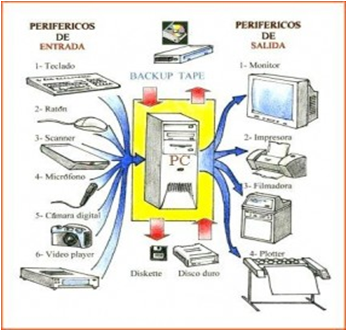

# Definiciones

#### La habilidad del cientifico informático es **resolver problemas**. La solución del problemas incluye:
    
    - Poder formular el problema
    - Pensar la solución **creativamente**
    - Expresar la solución con **claridad y presición**

#### ¿Qué es un programa?
       
Conjunto de **instrucciones ORDENADAS escritas en un lenguaje de programación** que le indican a una computadora **qué hacer** para resolver un problema o tarea. _Instrucciones que especifican como ejecutar una computación_

#### ¿Qué es una computadora?

  Es una máquina electrónica capaz de:
  - Recibir datos (Entrada _input_)
  - Procesarlos   (Procesamiento)
  - Almacenarlos  (Procesamiento)
  - Producir resultados (Salida _output_)

    Segun profe:
        
        - Calcular (computar) y almacenar valores de tareas hechas anteriormente.

#### ¿Qué necesita una computadora?

  - Hardware (físico)
  - Software (Programas)
  - Datos

#### Partes del modelo teórico de una computadora (modelo simplificado)
  - Unidad de entrada (Input): Recibe datos del usuario. Ejemplos: teclado, mouse, microfono, etc.
  - Unidad de procesamiento (CPU): Es el _cerebro_ de la computadora. Se encarga de ejecutar instrucciones, realizar cálculos y controlar el funcionamiento del sistema.
  - Memoria: Guarda información y datos. Ejemplos: Memoria principal (RAM) y Disco Duro/Sólido (Almacenamiento)
  - Unidad de salida (output): Muestra los resultados del procesamiento. Ejemplos: pantalla, parlantes, impresora, etc.

    

#### ¿Qué es el flujo de control?
 
  Es el **orden en que se ejecutan las instrucciones de un programa**. Indica que parte del programa se ejecuta y cuando.
  
  Por ejemplo:
    - Ejecutar una instrucción.
    - Pasar a la siguiente.
    - Tomar una desición
    - Repetir una parte del programa
  
  Las estructuras que controlan el flujo son: 
    - Secuencia
    - Condiciones (if)
    - Bucles (for, while)

#### Lenguajes de Alto y Bajo nivel
  
  Los lenguajes de programación se clasifican según **que tan cerca están del lenguaje de la computadora**

  - Lenguajes de **bajo nivel**

    Estan muy cerca del **lenguaje máquina**. Son dificles de leer para los humanos.
    Ejemplos: Lenguaje máquina (0 y 1) y ensamblador
    
    - Ventajas: Gran control de hardware.
    - Desventaja: Dificil de leer y escribir.

  - Lenguajes de **alto nivel**
  
    Están más cerca del **lenguaje humano**. Son más faciles de escribir y entender.
    Ejemplos: Python, Java, C++.
    
    - Ventajas: Más simples, legibles y productivos.

#### Lenguajes interpretador y compilados

  Los lenguajes se clasifican segun **cómo se ejecutan**
  
  - **Compilados**
    
    Primero se **traduce todo el programa** a lenguaje máquina.
    
    _codigo fuente &rarr; compilador &rarr; programa ejecutable_

    Ejemplos: C, C++, Go
    Ventaja: Ejecución rápida.
    

  - **Interpretados** 
      
      El programa se **traduce y ejecuta línea por línea**. No se genera un ejecutable.

      _código fuente &rarr; intérprete &rarr; ejecución inmediata_

      Ejemplos: Python, Javascript.
      Ventaja: Más flexible para probar y desarrollar.
---

# Actividades didácticas

## Lograr que el autómata salga de aula. (Profe es el autómata)
- Instrucciones básicas en infinitivo. (Ar- Er- Ir)

### Notas
- Escribir instrucciones depende del **estado inicial** (posición por ejemplo). Es decir, estas instrucciones no tendran el mismo resultado si estas parado en otro lado. También tener el cuenta el contexto, en donde está rodeado. Tambien definir el **objetivo**.
- Las instrucciones se pueden separar/fraccionar por **momentos**. En este caso tenemos momentos como _Llegar a puerta_ y _Salir_.
- Cada paso que damos el _estado_ **cambia**. Es decir, una vez que estamos en un lugar diferente o hayamos hecho algo nuevo, el estado cambió. Ya que, el siguiente paso puede depender del estado actual.

## Formas geométricas
- Por medio de un dibujo y en grupos, se deberán escribir instrucciones para que los demás puedan escribir ese dibujo que nos dieron.
