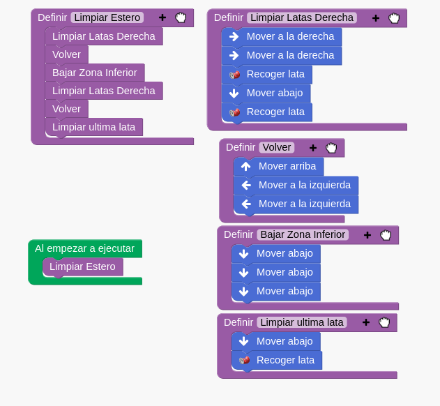
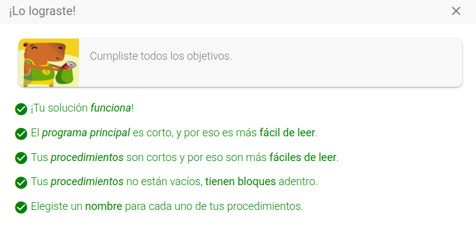
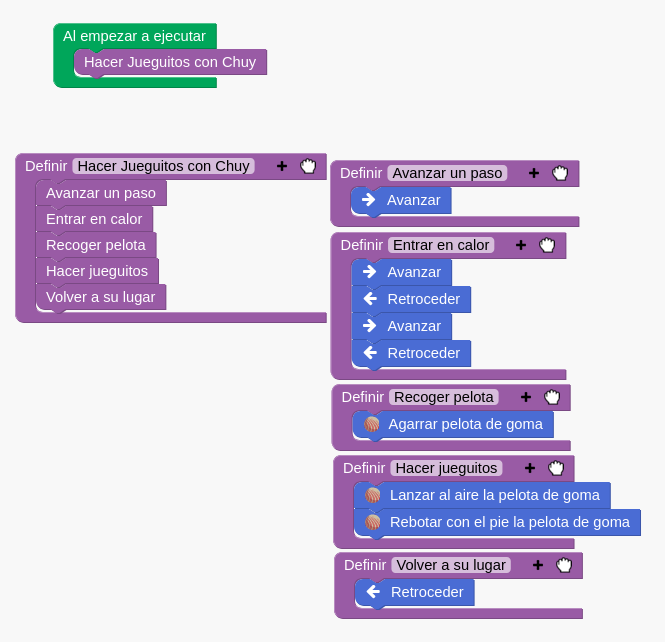
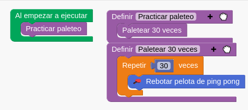
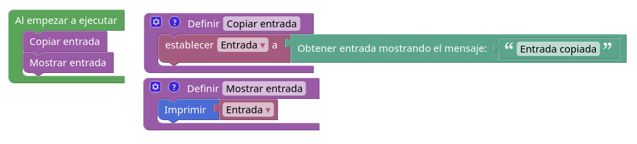
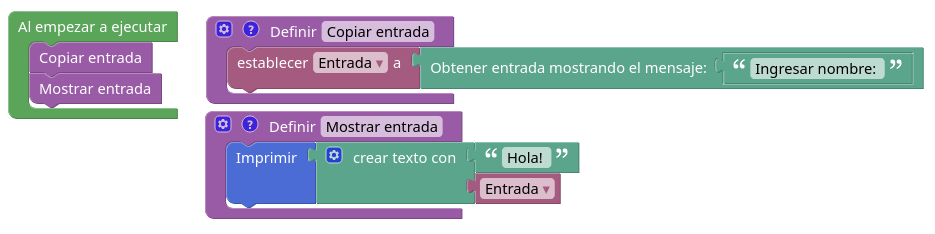
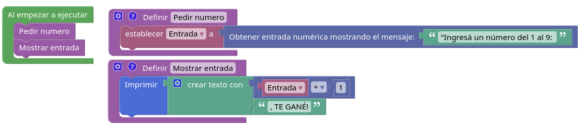
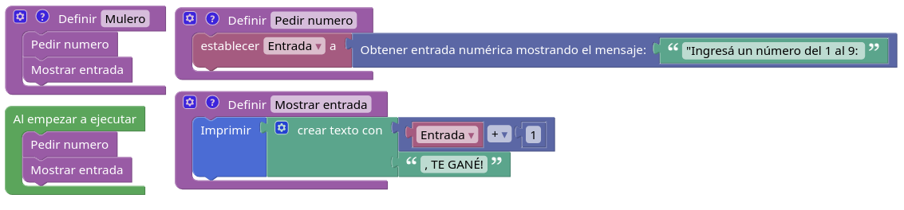
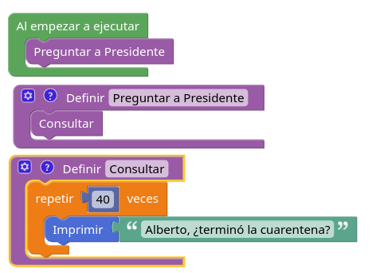
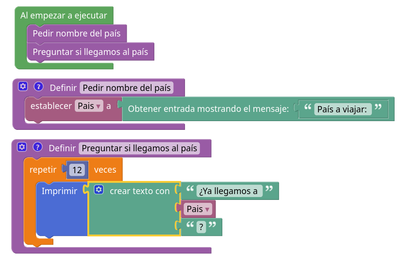

## Notas
 - Tipo de datos: Conjunto de valores
 Limites físicos para almacenar en variables

- Variables

- Ventajas de bloques no es necesario saber la sintaxis. Por que la funcion está definida?. Estan predefinidas

- Programación _top-down_ del objetivo general &rarr; estrategias/bloques &rarr; pasos/instrucciones

Legible - facil de programar

## Observaciones didácticas

- Actividad: Merienda
- Objetivo: Merendar con algo bebile y algo comestible.
- Contexto: Inicial: Los ingredientes estan al alcance. Hay en la mesa un plato y una taza.
- Acciones primitivas (Listadas acciones): Basicas sin "_". Es decir, solo responde a esa lista. No agregar más.
- Estrategias: Nombres de cada grupo. Bien detallado.

_Estirar brazo izquierdo
Agarrar saco de té
_Poner saco de té dentro de la taza.
_Tomar pava
Poner agua caliente
**Servir té**

_Agarrar tostada
Poner tostada
Poner queso crema
**Preparar tostada**

Merendar
**Merendar**

Se puede hacer un grupo con dos estrategias. Dos estrategias forman una funcion

- Qué se hizo. Repasar.

### Pilas bloques
Explicar.
Objetivo:
Estrategia:
Contexto inicial:

Ejercicio 2- intermedio
Escribir estrategia en pizarron

- Ejercicio 2
    
    

- Ejercicio 3

    

- Ejercicio 4

    

    

    

    

    Antes hablar de tipos de datos.
    
    - Mostrar el devolver la cadena que no puede sumarse. CONCATENACIÓN
    - Cambiar al tipo entero

    Explicar variables: "Nombre que le pongo a un dato"
    3 momentos: Creacion "ponerle nombre" - Inicializar - Modificar

    

    Explicar estados: cada linea o ejecucion, cambia el estado. EN este caso al alamacenar un dato en la variable, cambia el estado. El contexto!! Después la impresion es otro nuevo estado.

    

    