# Ejercicios Pilas Bloques

## Ejercicio 1

- Objetivo: Hacer subir a Guyrá a la cabeza de Capy.
- Estrategias:
  - Llegar hacia donde está Guyrá.
  - Subir a Guyrá a la cabeza de Capy.
 
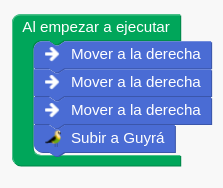

## Ejercicio 2

- Objetivo: Limpiar el estero con Capy recogiendo las latas tiradas.
- Estrategias:
  - Recoger las latas del lado derecho.
  - Volver al punto de inicio.
  - Mover hasta la zona inferior.
  - Recoger las latas del lado derecho. (Se reutilizan las mismas instrucciones por tener el mismo camino por recorrer)
  - Volver al punto de inicio. (Se reutilizan las mismas instrucciones por el mismo camino por recorrer)
  - Recoger la última lata.

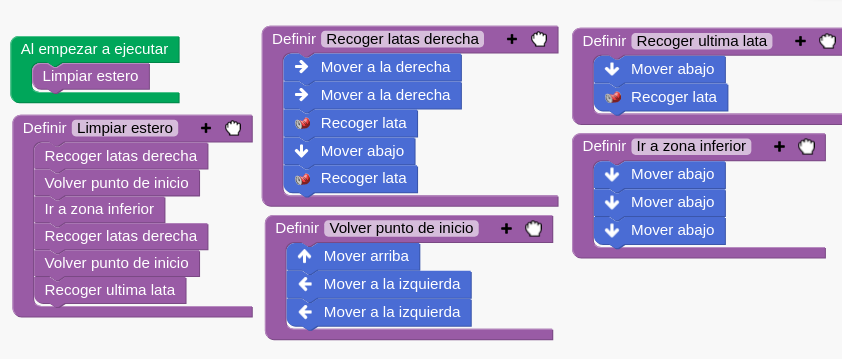

## Ejercicio 3

- Objetivo: Hacer jueguitos de pelota con Chuy
- Estrategias:
  - Calentar
  - Hacer jueguitos
  - Volver al lugar donde estaba

  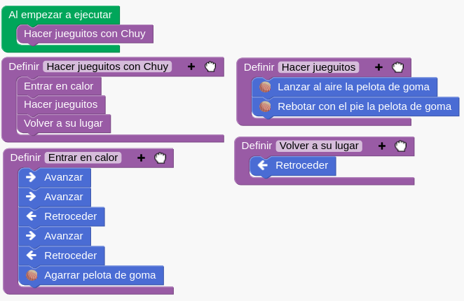

## Ejercicio 4

- Objetivo: Hacer que hay paletée la pelotita 30 veces.
- Estrategias:
  - Calentar
  - Hacer jueguitos
  - Volver

  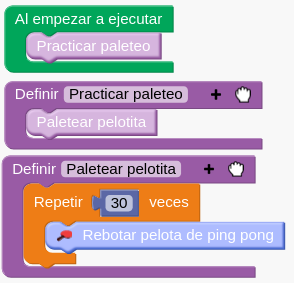

## Ejercicio 5
- Objetivo: Observar todas las estrelas con Mañic
- Estrategias:
  - Observar estrellas abajo
  - Observar estrellas derecha
  - Observar estrellas arriba

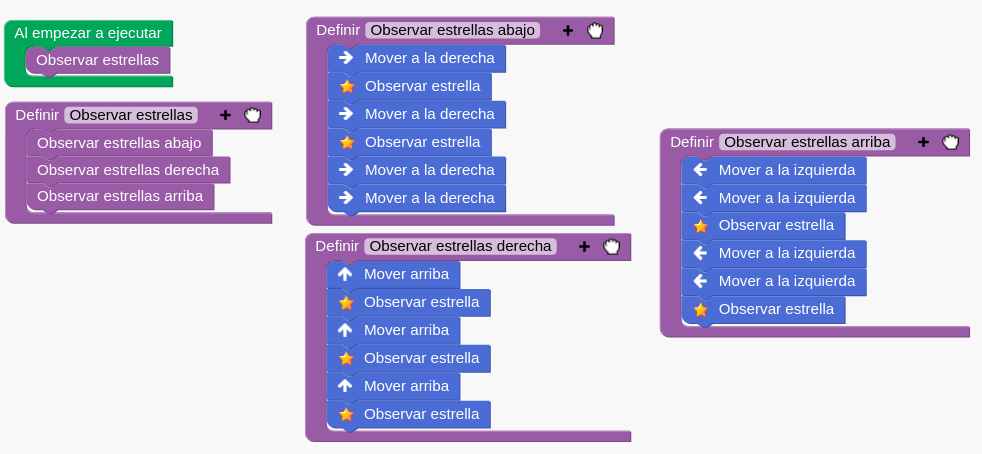

## Ejercicio 6
- Objetivo: Recoger todos los trofeos de Chuy
- Estrategias:
  - Recoger primer trofeo.
  - Recoger trofeo restantes. (Usando repeticion porque se repite mismo patron de movimientos)

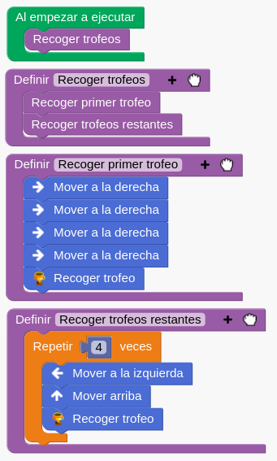

## Ejercicio 7
- Objetivo: Despertar a todas las luciernagas
- Estrategias:
  - Despertar luciernagas superior
  - Despertar luciernagas inferior

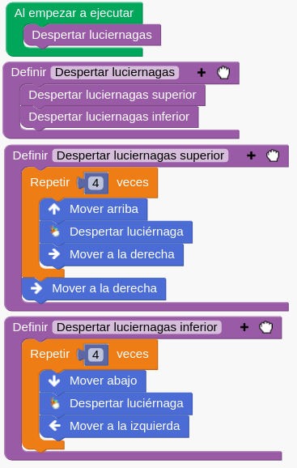

# Ejercicios Zamba

## Ejercicio 1 - Hola mundo

- Objetivo: Imprimir "¡Hola mundo!"
- Estrategias:
  - Saludar imprimiendo una cadena de texto

  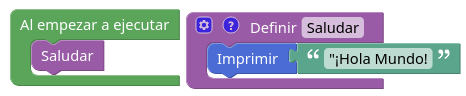

## Ejercicio 2 - Copiando la entrada

- Objetivo: Copiar y mostrar lo que el usuario escriba
- Estrategias:
  - Copiar entrada: Creamos una variable _"entrada"_ donde vamos a almacenar lo que el usuario escriba
  - Mostrar entrada: Mostramos el contenido de la variable _"entrada"_.

  

## Ejercicio 3 - Saludar al usuario

- Objetivo: Saludar al usuario con su nombre.
- Estrategias:
  - Copiar nombre: Creamos una variable _"entrada"_ donde vamos a almacenar el nombre que el usuario escriba.
  - Saludar: Mostramos un saludo al usuario junto al nombre que almacenamos en _"entrada"_.

  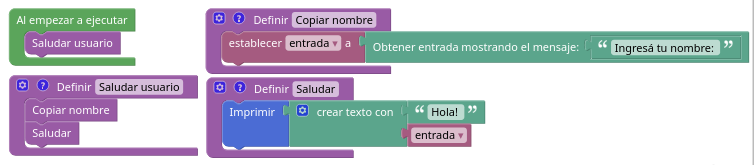

## Ejercicio 4 - Mulero

- Objetivo: Pedir al usuario un numero del 1 al 9. Sin importar el numero ingresado, le vamos a sumar un número más y le vamos a responder diciendo "Te gané".
- Estrategias:
  - Pedir numero: Pedir al usuario un numero del 1 al 9
  - Sumar número: Sumar un número al número ingresado por el usuario.
  - Mostrar mensaje: Mostrar mensaje con el numero sumado y con el mensaje "te gané".

  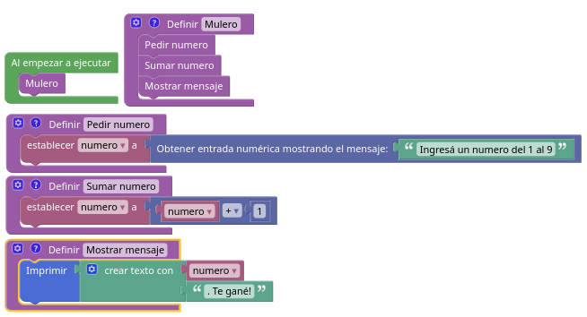

## Ejercicio 5 - Porciones de pizza (CV)

- Objetivo: Saber **cuantas porciones de pizza me sobran** sabiendo que cada pizza tiene ocho porciones y todas las personas comen la misma cantidad.
- Estrategias:
  - Pedir cantidad de personas invitadas: Guardamos su valor en variable _personas invitadas_
  - Pedir cantidad de pizzas compradas: Guardamos su valor en variable _pizzas compradas_. *(En este caso tambien pedí al usuario cuantas porciones comen por invitado y lo guardé en variable __cantidad comida invitado__)*
  - Hacer calculos:
    - Crear variable _total porciones_: Multiplicar por 8 la cantidad de **pizzas compradas**
    - Crear variable: _porciones comidas_: Multiplicar por **cantidad comida invitado** la cantidad de **personas invitadas**
    - Crear variable _porciones sobrantes_: Restar **porciones comidas** a **total porcioones**
  - Mostrar calculos: Imprimir valores y resultados
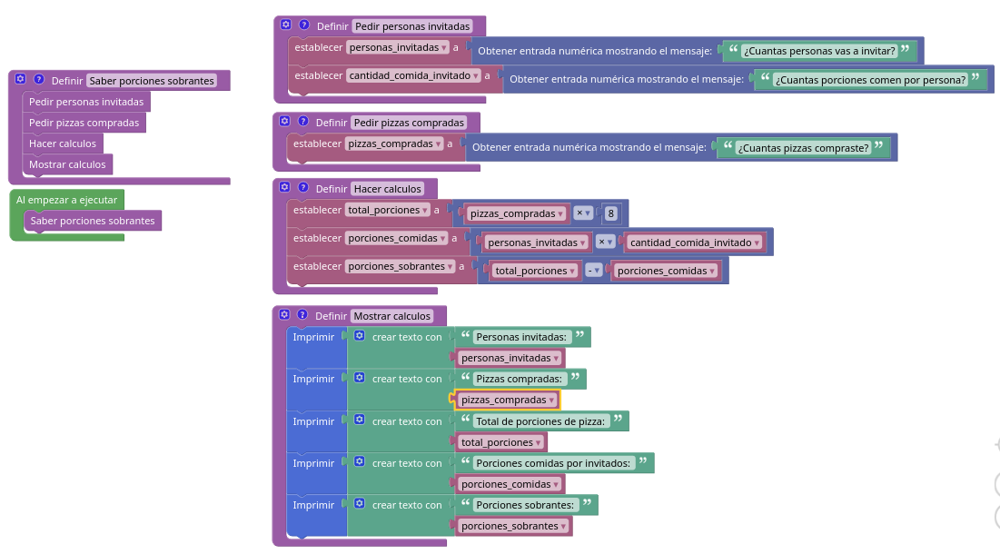
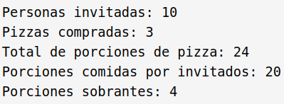

## Ejercicio 6 - Comentar sobre el nombre de usuario
- Objetivo: Mostrar comentario e informar la cantidad de letras que tiene el nombre que el usuario nos dió.
- Estrategia:
  - Ingresar nombre: Copiar y almacenar en una variable el nombre que el usuario nos dió.
  - Mostrar mensajes:
    - Mostrar mensaje personalizado.
    - Mostrar la cantidad de letras del nombre que almacenamos en la variable.

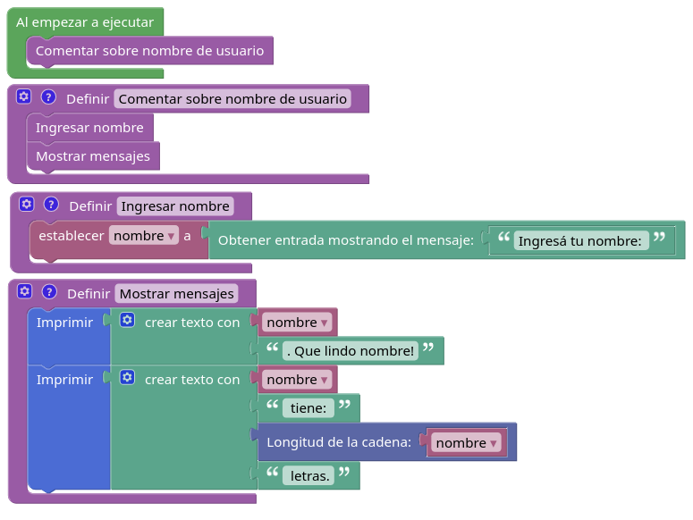

## Ejercicio 7 - Comentando nombres V2
- Objetivo: Mostrar comentario acerca del nombre que nos dé el usuario dependiendo de la longitud del mismo.
- Estrategia
  - Ingresar nombre: Copiamos y almacenamos en una variable el nombre que el usuario nos dá.
  - Calcular longitud del nombre: Guardamos en una variable _longitud nombre_ la longitud del nombre que nos dió el usuario.
  - Mostrar mensajes: (**Mediante el uso del condicional IF**)
    - **Si el nombre tiene más de 5 letras:** imprime _"NOMBRE, ¡Un nombre maravilloso_
    - **Si el nombre tiene menos de 5 letras:** imprime _"NOMBRE, ¡Ese es un gran nombre!"_

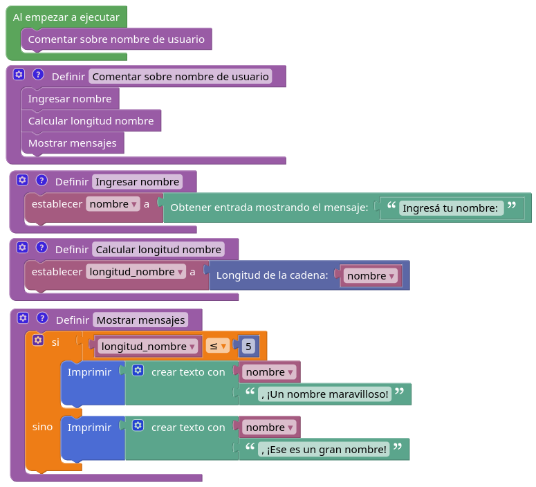

## Ejercicio 8 - Fortaleza de contraseña
- Objetivo: Indicar si la contraseña es **buena, mala o media** dependiendo de su **longitud**.
- Estrategias:
  - Pedir contraseña: Pedir y almacenar en una variable la posible contraseña del usuario.
  - Calcular longitud contraseña: Guardamos la longitud de la contraseña en una variable.
  - Mostrar Mensaje:
    - Si la longitud de la contraseña es menor a 5: Mostraremos la contraseña de color **ROJO**
    - Si la longitud de la contraseña es mayor a 8: Mostraremos la contraseña de color **VERDE**
    - Si la longitud de la contraseña es mayor o igual a 5 y es menor o igual a 8: Mostraremos la contraseña de color **AMARILLO**

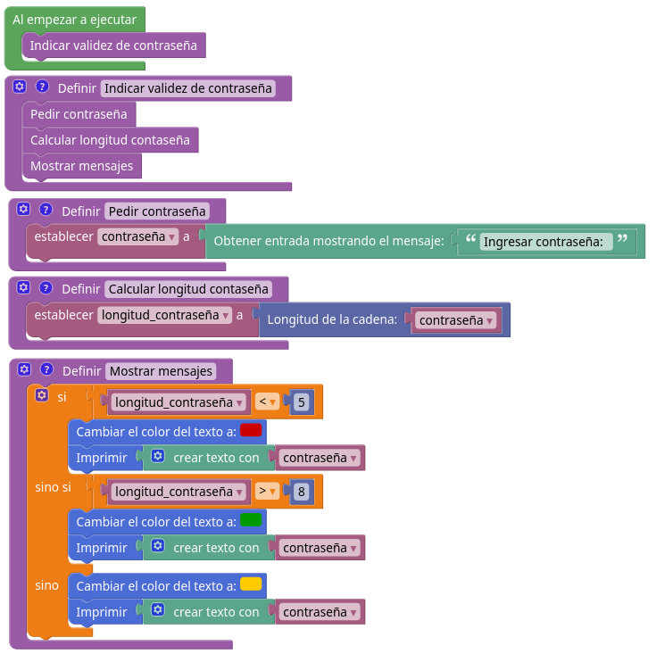

## Ejercicio 9 - Tenes que trabajar
- Objetivo: Verificar mediante **edad** y **sexo** si usuario puede ir de vacaciones o trabajar.
- Estrategias:
  - Pedir datos: Pedir y almacenar los siguientes datos que ingresará el usuario: Sexo, DNI y edad.
  - Mostrar Mensaje: Mostrar verificacion calculando la edad y el sexo del usuario.
    - **Primera verificacion**: Verificamos si es mayor o no.
    - **Segunda verificacion**: Si es mayor, verificamos **Sexo**
    - **Tercera verificacion**: Dependiendo del sexo, verificamos edad.

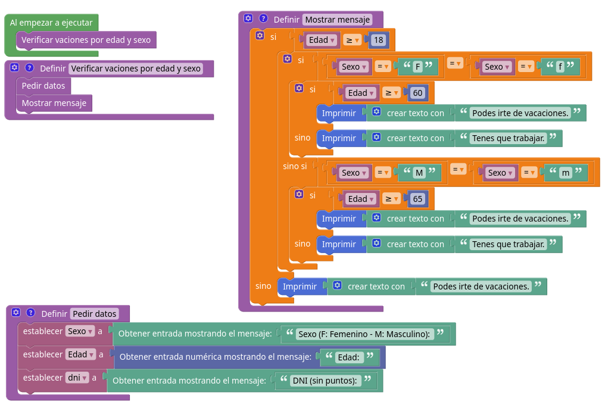

## Ejercicio 10 - ASPO
- Objetivo: Preguntar 40 veces al presidente si ya terminó la cuarentena.
- Estrategias:
  - Preguntar: Imprimir en un bloque de repetición (40 veces) si ya terminó la cuarentena.

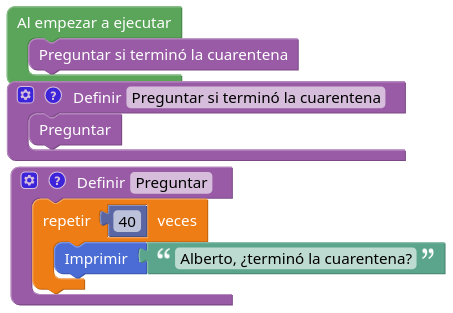

## Ejercicio 11 - Los Simpsons
- Objetivo: Preguntar 12 veces si _"Ya llegamos a NOMBREPAIS"_.
- Estrategia:
  - Preguntar nombre de país: Guardar en variable _pais_ el pais que ingrese el usuario.
  - Mostrar mensaje: Preguntar _"¿Ya llegamos a "pais"?"_ en un bloque de repetición de 12 veces.

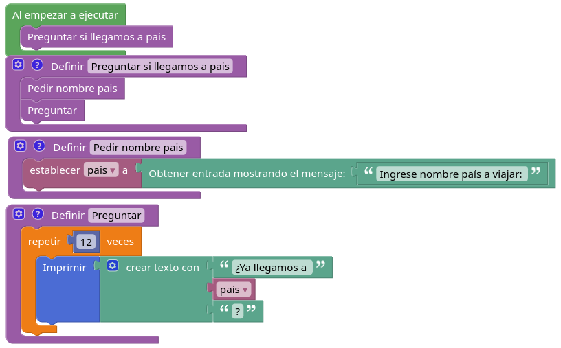

## Ejercicio 12 - El autómata puede contar
- Objetivo: Elaborar un programa con capacidad de contar desde 1 hasta 10.
- Estrategia
  - Crear variable: Crear una variable numérica inicializandola en 1. 
  - Contar: Imprimir en un bloque de repetición de 10 veces, el valor de la variable, y por cada repitición, sumarle 1.

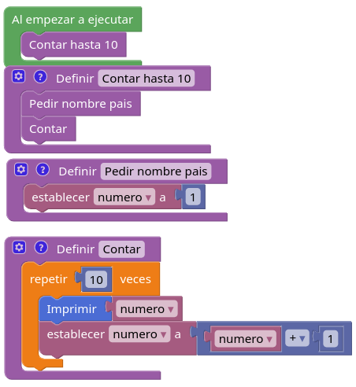

## Ejercicio 13 - Eco
- Objetivo: Mostrar _x_ veces la palabra _Eco_ en la salida.
- Estrategia:
  - Inicializar datos: 
    - Inicializar _metros_ con lo que ingrese el usuario.
    - Inicializar _contador metros_ a 0  
  - Mostrar mensaje:
    - Mostrar la cantidad de metros que ingresó el usuario. 
    - Mostrar _"Eco"_ la cantidad de veces que ingresó en metros el usuario.
    - Mostrar un contador de ecos al lado de _"Eco"_

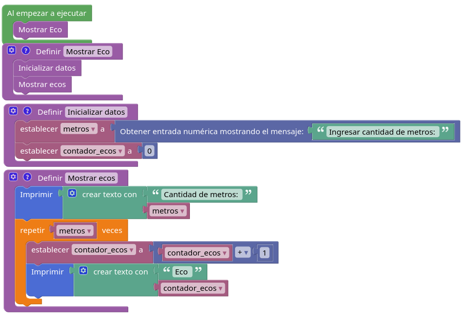

## Ejercicio 14 - Cuenta regresiva.
- Objetivo: Contar regresivamente.
- Estrategia:
  - Pedir numero usuario: 
    - Pedir al usuario un numero para saber donde empezar a contar regresivamente. 
    - Almacenar ese numero en variable _numero_ para usarlo en el bloque de repetición.
    - Almacenar en _contador_ el valor de _numero_ para mostrarlo en la repetición.
  - Contar: Contar regresivamente, en un bloque de repetición **(_numero_ veces)**, restando por cada repeticion el valor de _contador_ hasta llegar a 0.

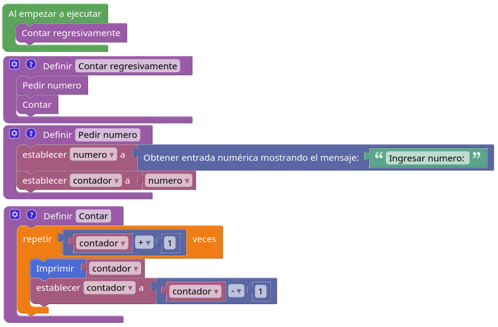

## Ejercicio 15 - Zamba viaja al pasado.
- Objetivo: Viajar desde este año hasta el año que el usuario ingrese.
- Estrategia:
  - Pedir año usuario:
    - Pedir al usuario el año a viajar.
    - Almacenar ese año en variable _año_.
    - Almacenar en _contador año_ el año actual.
  - Calcular años:
    - Restar la cantidad de años de diferencia entre el año actual y la variable _anio_
    - Almacenar resta en variable _viajar años_
  - Mostrar viaje
    - Imprimir _"Viajando hacia AÑOAVIAJAR"_
    - Mostrar en un bloque de repetición _viajar años_ veces + 1 (+1 porque es necesaria una iteración más)
    - Restar a _contador año_ - 1 por cada iteración hasta llegar al año deseado.

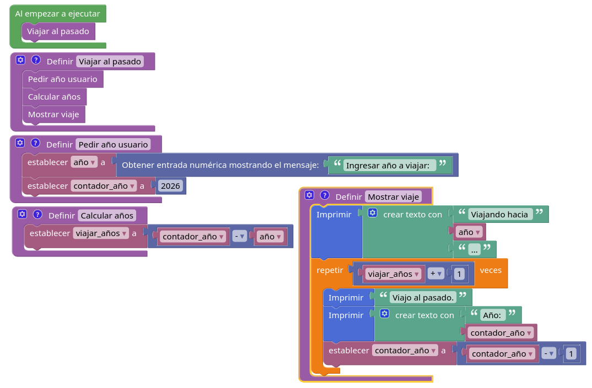