## Ejercicio "Jubilación docente"
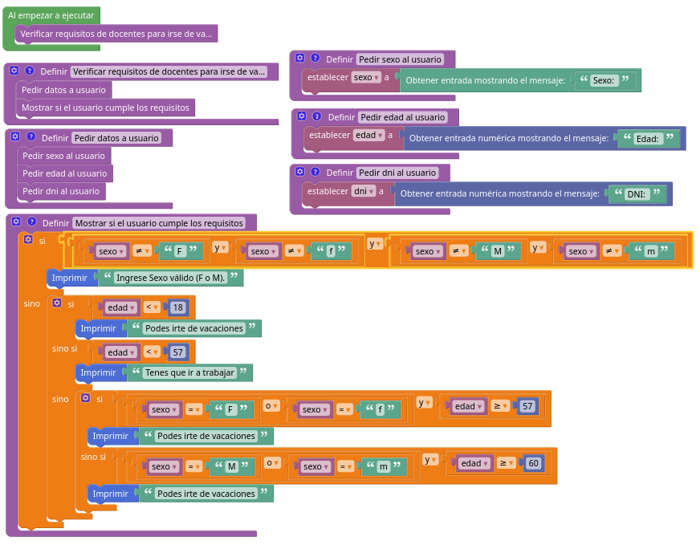
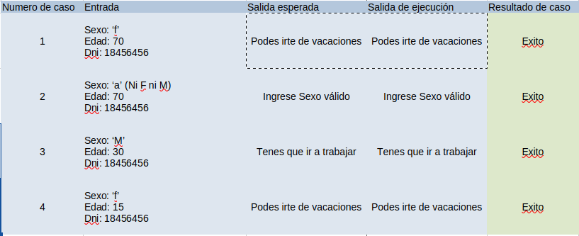

## Ejercicio "Formar palabra con dos palabras"
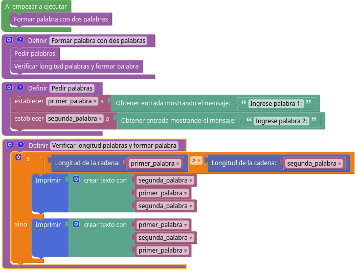
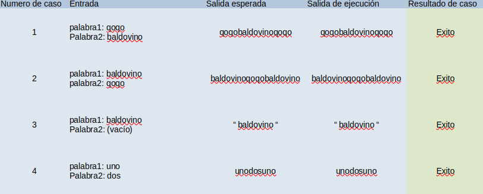

## Ejercicio "Conversion en unidades de temperatura"
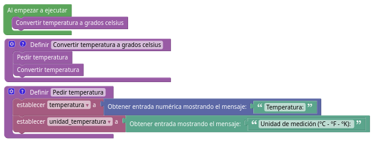
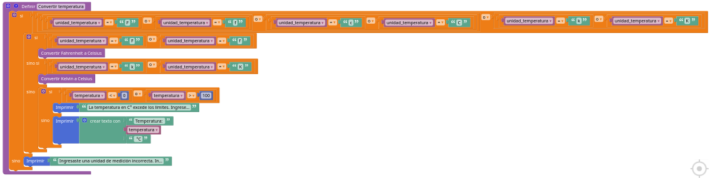
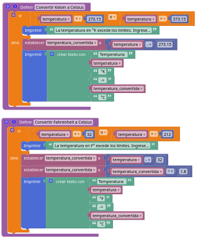
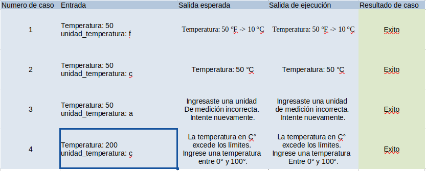

## Ejercicio "Fiesta de UNIPE"
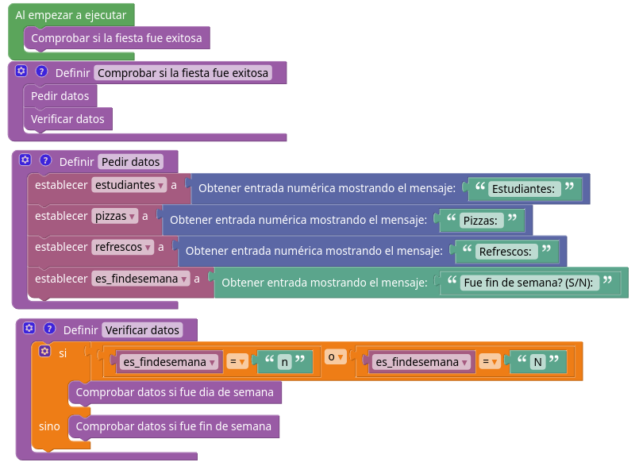
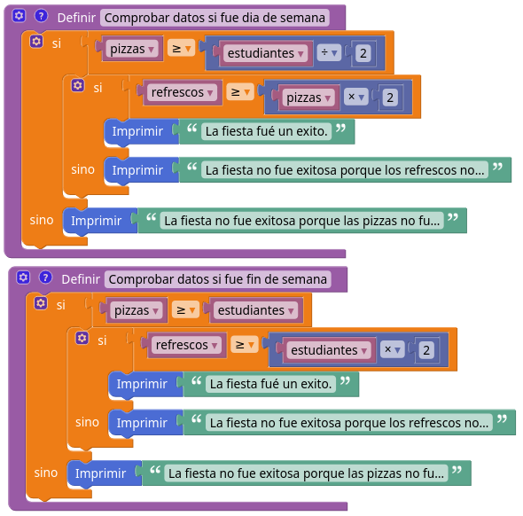
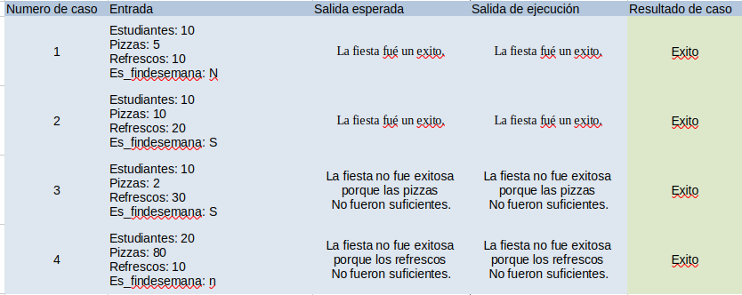

## Ejercicio "Un poco de matematica"
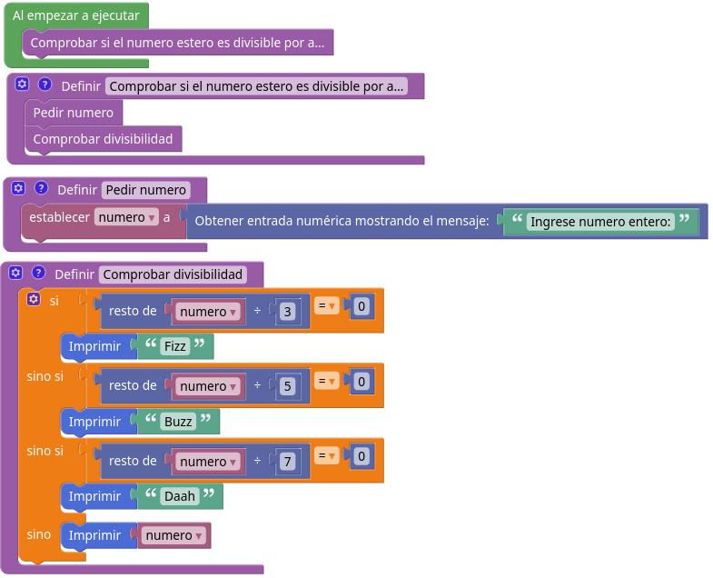
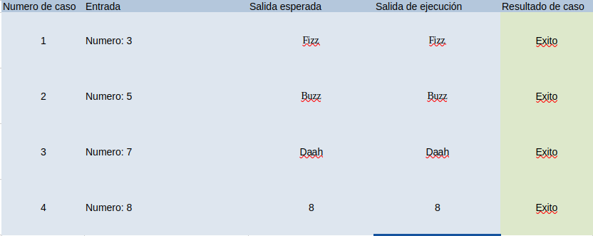