## Guia de actividad: Repetición con secuencias

#### Tarea 1:
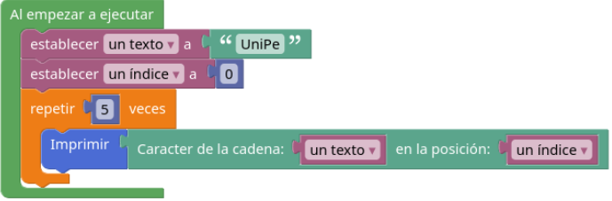

Imprimirá 5 veces el caracter 'U'.

### Tarea 2:

Se comporta como había predicho

### Tarea 3:

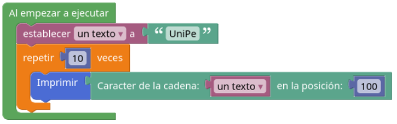

Este código imprime 10 veces caracteres vacíos porque está queriendo imprimir caracteres fuera del tamaño del texto "UniPe".
Los cambios que haría serían agregar una variable nueva inicializada en 0 y sumarle 1 por cada repetición para que vaya recorriendo el texto caracter por caracter.

**B:**

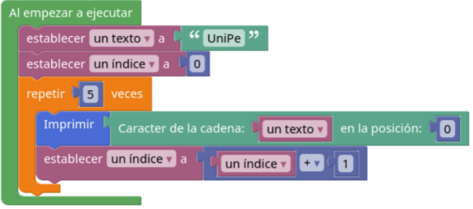

- La salida del programa: U U U U U
- Variable un índice: 0 1 2 3 4 5

**C:**

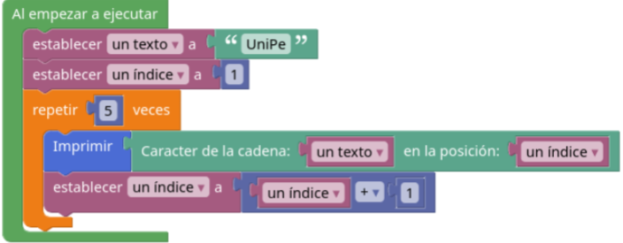

- Salida del programa: n i P e " " 
- Variable un índice: 0 1 2 3 4 5

**D:**

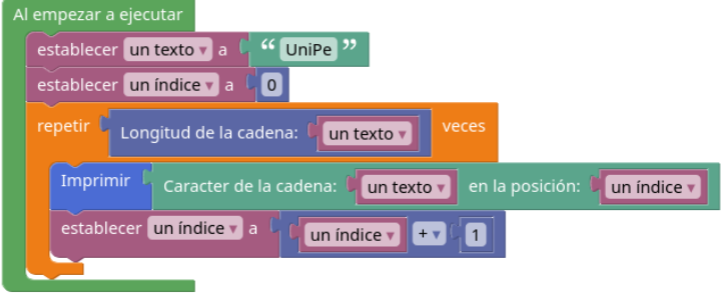

- Salida del programa: U n i P e
- Variable un índice: 1 2 3 4 5 6

### Tarea 4

**A:** Para que la salida sea U n i P e en este programa:

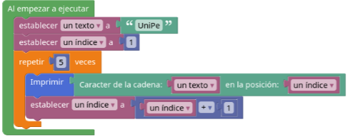

Cambio: se cambia el valor de inicialización de "un índice" al valor 0.

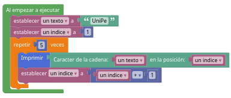

**B:** Para que la salida sea ABCDERFGHIJK en este programa:

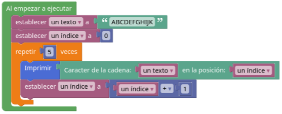

Cambio: se cambia el valor de repetición 5 por la longitud de la cadena "un texto"

**C:** Para que la salida sea ACEGIK en este programa:

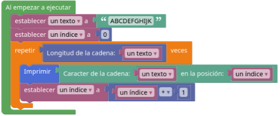

Cambio: se cambia el valor de incremento del valor "un indice" a 2

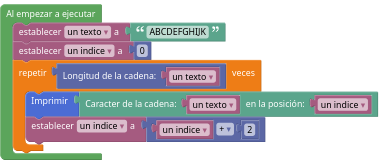

### Tarea 5: 

Crear un programa que pida al usuario que ingrese una frase, imprimir todas y cada una de las letras de dicha frase.

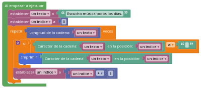

## Ejercicio 16 - "La "letra" elegida"
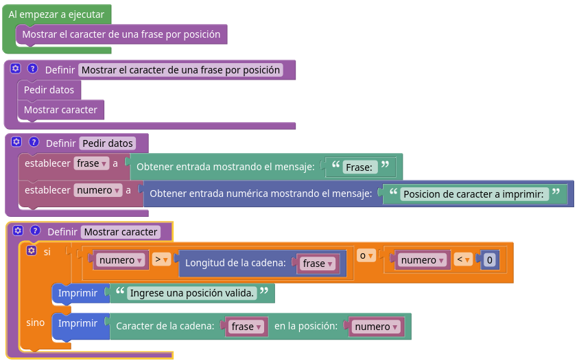

## Ejercicio 17 - Generador de apócopes
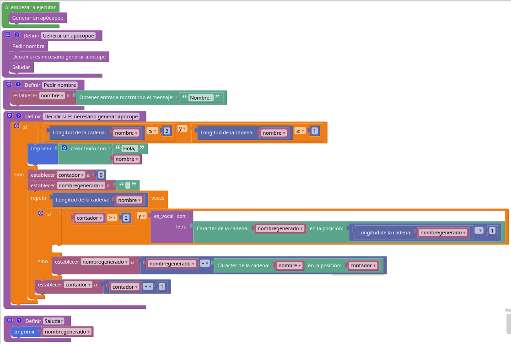

## Ejercicio 18 - Vi un avión (minúsculas)
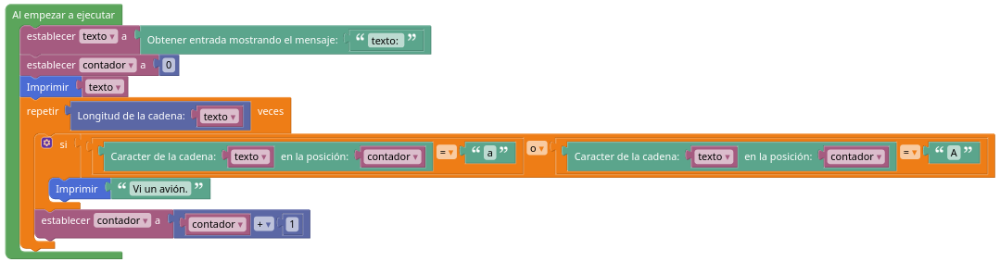