# Ejercicios Pilas Bloques

## Ejercicio: "Limpiando el humedal".

#### Objetivo:
  - Reciclar e irse de paseo en yacaré.
 
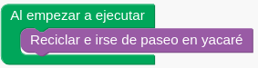
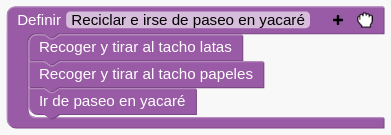

#### Estrategia
  - Recoger y tirar al tacho latas. (Se repite 3 veces)
  - Recoger y tirar al tacho papeles. (Se repite 3 veces)
  - Ir de paseo en yacaré.

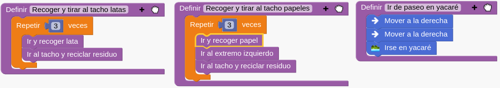

#### Tareas
  - Ir y recoger lata 
  - Ir y recoger papel
  - Ir al tacho y reciclar residuo

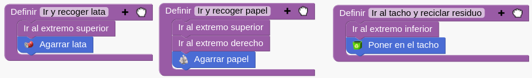

#### Subtareas
  - Ir al extremo superior
  - Ir al extremo inferior
  - Ir al extremo derecho
  - Ir al extremo izquierdo

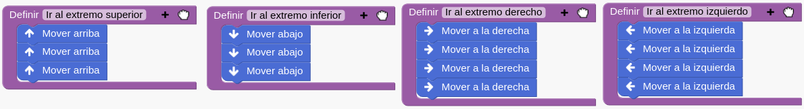

## Ejercicio: "La pelota indecisa".

#### Objetivo:
  - Practicar tiros libres con Chuy (Siempre y cuando esté la pelota en cancha).

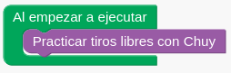
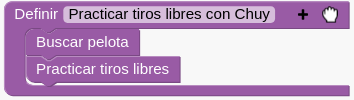

#### Estrategia
  - Buscar la pelota
  - Practicar tiros libres (Activa tarea _practicar_ si se activa el condicional _Si_)

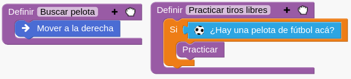

#### Tareas
  - Practicar (Si hay pelota en cancha)

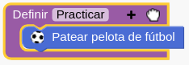

## Ejercicio: "¿Pelota o paleta?".

#### Objetivo:
  - Jugar a la pelota con chuy.
 
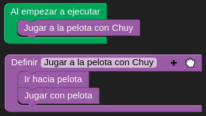

#### Estrategia
  - Ir hacia la pelota.
  - Jugar con la pelota (Dependiendo el resultado del condicional _Si_)

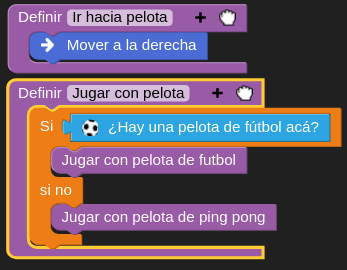

#### Tareas
  - Jugar con pelota de futbol
  - Jugar con pelota de pingpong

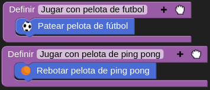

## Ejercicio: "Las estrellas de Mañic".

#### Objetivo
  - Observar la estrella con Mañic

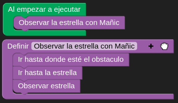

#### Estrategia
  - Ir hasta donde esté el obstaculo.
  - Ir hacia la estrella
  - Observar la estrella

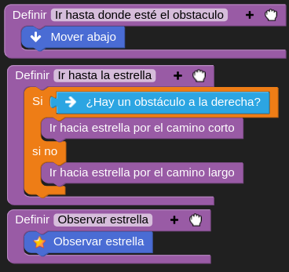

#### Tareas
  - Dependiendo la ubicación de la estrella (Operador condicional _Si_)
    - Ir hacia estrella por camino corto
    - Ir hacia estrella pro camino largo

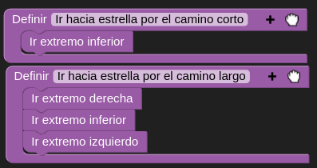

#### Subtareas
  - Ir extremo inferior
  - Ir extremo izquierdo
  - Ir extremo derecho

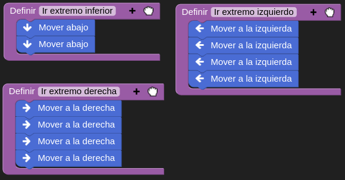

## Ejercicio: "La estrella especial".

#### Objetivo
 - Observar la estrella con Mañic

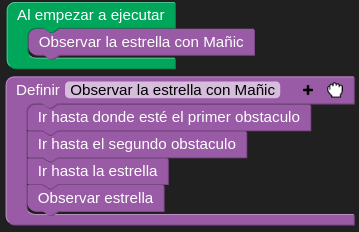

#### Estrategia
  - Ir hasta donde esté el primer obstaculo.
  - Ir hasta donde esté el segundo obstaculo.
  - Ir hacia la estrella
  - Observar la estrella

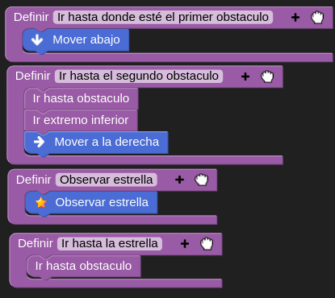

#### Tareas

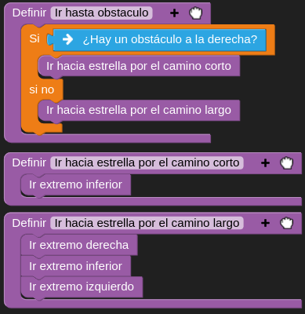

#### Subtareas

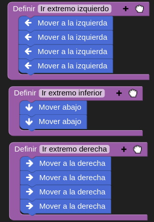

## Ejercicio: "Hilera de latas".

#### Objetivo

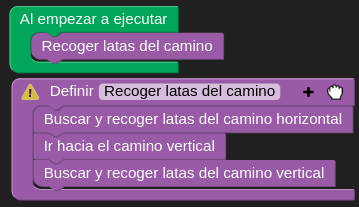

#### Estrategia

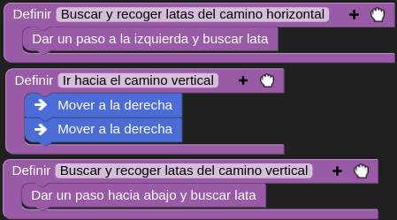

#### Tareas

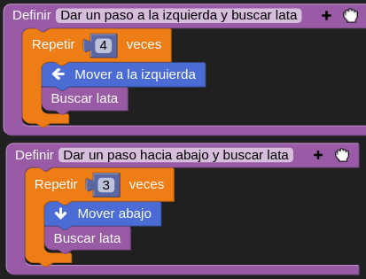

#### Subtareas

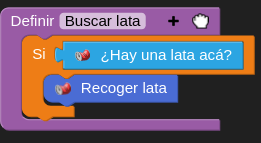