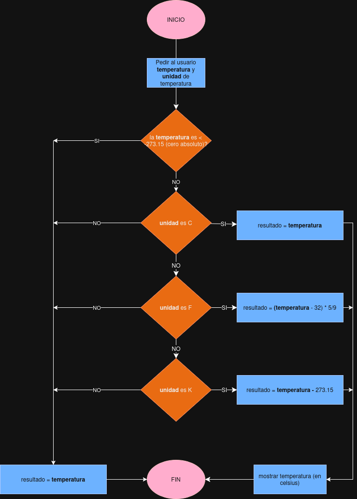
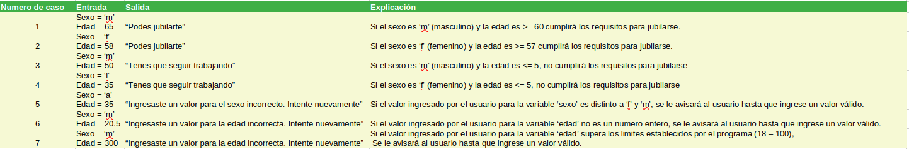
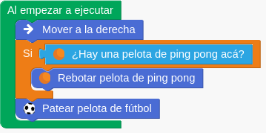

# Simulacro parcial

## Parte 1.

### Programación

La programación consiste en escribir y organizar instrucciones a una computadora para que realice una determinada acción o tarea.
En la programación, la división de subtareas es muy importante porque mediante un problema complejo, se puede descomponer nuestra tarea principal para una mejor comprensión, organización y nos facilita a detectar futuros errores.

### Identificación de errores

El **error sintáctico** ocurre cuando nuestro programa no se ejecuta o falla durante la ejecución por una falta de compresión de la computadora. Es decir, que las instrucciones que escribimos, no las puede ejecutar porque no las entiende. 
En cambio, un **error semántico** sí se ejecuta pero no cumple con la tarea esperada, dandonos así un resultado incorrecto.
**error de ejecución**

### Variables y estado

Una **variable** es una etiqueta o nombre que se le asigna a un valor. Esta variable puede ser usada y modificada durante la ejecución del programa.
etapas variables: crean, inicializar y modificar
Al modificar o asignar un valor a esta variable, el **estado** del programa cambia. Ya que el estado de un programa, son todos los valores asignados en las variables en un momento determinado del programa.

## Parte 2

### Ejercicio 1: Diagrama de flujo (Lógica de decisiones)

### Ejercicio 2: Escritura de Casos de Prueba (Testing)

### Ejercicio 3: Explicar código con error y arreglarlo.

**Identificacion del error:** Esté o no esté la pelota de ping pong, Chuy siempre pateará la pelota de futbol.
En caso de que esté la pelota de ping pong, la hará rebotar. Pero despues de esa acción, intenterá patear la pelota de futbol.

**Solución**: Sería correcto agregar la acción "Patear pelota de fútbol" dentro de la acción alternativa del "Sí" que es "Sino" para que se ejecute en el único caso de que no esté la pelota de ping pomg.
ALTERNATIVA CONDICIONAL
REPETICION SIMPLE Y FIJA
SECUENCIAS